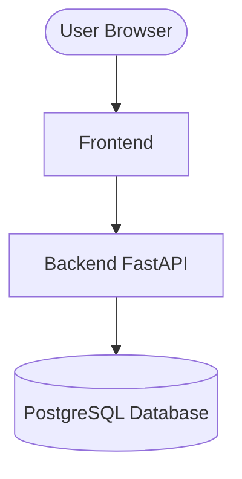

# 🛵 SEWAIN — Platform Sewa Barang Online

> Aplikasi web platform penyewaan barang berbasis multi-role, dibangun dengan FastAPI + React + PostgreSQL,
> dan di-deploy menggunakan Docker.
>
> **Mata Kuliah:** Komputasi Awan — Sistem Informasi, Institut Teknologi Kalimantan (ITK)
> **Tim:** Kelompok Harahetta-2

---

## Daftar Isi

1. [Deskripsi Aplikasi](#1-deskripsi-aplikasi)
2. [Tim](#2-tim)
3. [Fitur Utama](#3-fitur-utama)
4. [Tech Stack](#4-tech-stack)
5. [Arsitektur Sistem](#5-arsitektur-sistem)
6. [Getting Started](#6-getting-started)
7. [Makefile Workflow Commands](#7-makefile-workflow-commands)
8. [Roadmap](#8-roadmap)
9. [Project Structure](#9-project-structure)
10. [API Documentation Testing](#10-api-documentation-testing)
11. [UI and API Integration Testing](#11-ui-and-api-integration-testing)
12. [Authentication and CRUD Testing](#12-authentication-and-crud-testing)

---

## 1. Deskripsi Aplikasi

SEWAIN adalah platform berbasis web yang memfasilitasi proses penyewaan barang secara online secara lebih mudah, aman, dan terstruktur. Melalui sistem ini, penyedia dapat menampilkan dan mengelola barang yang disewakan, sementara pengguna dapat mencari barang, melihat detail, menentukan periode sewa, serta mengajukan permintaan penyewaan secara langsung. Platform ini juga dilengkapi dengan pengelolaan status transaksi secara real-time dan fitur verifikasi identitas penyewa untuk meningkatkan keamanan selama proses penyewaan.

SEWAIN ditujukan bagi pelaku usaha penyewaan khususnya UMKM, serta masyarakat yang membutuhkan suatu barang tanpa harus membelinya melainkan cukup dengan menyewanya. Platform ini membantu mengatasi berbagai kendala dalam sistem penyewaan manual, seperti pencatatan yang tidak rapi, jangkauan pelanggan yang terbatas, serta risiko penyalahgunaan barang. Dengan digitalisasi melalui Sewain, proses pengelolaan menjadi lebih efisien, transparan, dan dapat menjangkau lebih banyak pengguna.

---

## 2. Tim

| Nama | NIM | Peran |
|------|-----|-------|
| Djaky Abbyyu Fauzan Timumum | 10231032 | Lead Backend |
| Achmad Zaki Zaidan | 10231002 | Lead Frontend |
| Muhammad Alif Setiawan | 10231056 | Lead DevOps |
| Riqqah Khalda Karina | 10231082 | Lead QA & Docs |

---

## 3. Fitur Sistem

SEWAIN memiliki tiga peran utama dalam sistem:

- Super Admin  
- Admin (Penyedia Barang)  
- User (Penyewa)

| Peran | Kategori | Fitur Utama | Detail / Deskripsi |
|-------|----------|-------------|--------------------|
| Super Admin | Manajemen Admin | Pengelolaan Penyedia | Login sebagai Super Admin, melihat daftar seluruh admin (penyedia), menambahkan admin baru, mengedit data admin, dan menghapus admin. |
|  | Manajemen Konten | Pengelolaan Kategori Barang | Mengelola kategori barang yang tersedia di dalam platform. |
|  | Monitoring | Pengawasan Platform | Melihat seluruh aktivitas penyewaan dan melakukan monitoring keseluruhan platform secara menyeluruh. |
| Admin (Penyedia Barang) | Profil & Usaha | Pengelolaan Profil Usaha | Login sebagai admin dan mengelola profil usaha penyewaan. |
|  | Manajemen Produk | Pengelolaan Barang | Menambahkan barang yang disewakan, mengedit data barang, menghapus barang, mengatur harga sewa, dan mengatur jumlah atau stok barang. |
|  | Manajemen Order | Kontrol Permintaan Sewa | Melihat daftar permintaan sewa dari user, menyetujui atau menolak permintaan sewa. |
|  | Monitoring Transaksi | Status Penyewaan | Mengubah status penyewaan menjadi Pending, Disetujui, Sedang Disewa, atau Selesai. |
| User (Penyewa) | Akun & Profil | Registrasi & Data Diri | Registrasi akun, login, melengkapi data diri berupa nama lengkap, nama orang tua, alamat tempat tinggal, dan share location melalui peta atau koordinat. |
|  | Verifikasi Identitas | Validasi Legalitas | Upload foto KTP, upload foto selfie dengan KTP, dan melihat status verifikasi berupa Menunggu Verifikasi, Disetujui, atau Ditolak. |
|  | Aturan Sistem | Validasi Penyewaan | User hanya dapat melakukan penyewaan apabila data diri telah lengkap dan verifikasi identitas telah disetujui oleh admin. |
|  | Penyewaan | Proses Pemesanan | Melihat katalog barang dari berbagai penyedia, melihat detail barang, mencari barang, serta mengajukan penyewaan dengan memilih tanggal mulai dan tanggal selesai. |
|  | Monitoring | Status & Riwayat | Melihat status penyewaan berupa Pending, Disetujui, Sedang Disewa, atau Selesai, serta melihat riwayat penyewaan sebelumnya. |

---

## 4. Tech Stack

Bagian ini menjelaskan teknologi yang digunakan untuk membangun dan menjalankan aplikasi SEWAIN.

| Teknologi | Fungsi |
|-----------|--------|
| Python | Bahasa pemrograman utama untuk backend |
| FastAPI | Framework untuk membangun REST API |
| Uvicorn | Server untuk menjalankan aplikasi FastAPI |
| SQLAlchemy | ORM untuk menghubungkan aplikasi dengan database |
| PostgreSQL | Sistem database untuk menyimpan data |
| python-jose | Mengelola autentikasi berbasis JWT |
| passlib + bcrypt | Mengamankan password dengan hashing |
| Pydantic | Validasi data dan schema API |
| React | Library untuk membangun antarmuka pengguna |
| Vite | Tools untuk build dan pengembangan frontend |
| React Router DOM | Mengatur navigasi antar halaman |
| Tailwind CSS | Framework styling antarmuka |
| Radix UI | Komponen UI yang mudah diakses |
| Lucide React | Library ikon pada antarmuka |
| Sonner | Menampilkan notifikasi pada sistem |
| Docker | Containerisasi seluruh aplikasi |
| Docker Compose | Mengelola beberapa container sekaligus |
| Nginx | Web server untuk frontend |
| Docker Hub | Penyimpanan image aplikasi |

---

## 5. Architecture

Bagian ini menunjukkan hubungan antar komponen utama dalam aplikasi Sewain, mulai dari pengguna, frontend, backend, hingga database dalam menjalankan sistem.



Diagram di atas menunjukkan alur kerja utama dalam sistem Sewain secara sederhana. Setiap komponen memiliki peran masing-masing dalam menjalankan aplikasi, yaitu sebagai berikut:

- User Browser

  Pengguna mengakses aplikasi melalui browser untuk melihat tampilan sistem dan melakukan berbagai aktivitas seperti login, mencari barang, maupun melakukan penyewaan.

- Frontend

  Frontend berfungsi sebagai antarmuka pengguna yang menampilkan halaman aplikasi serta menerima input dari pengguna sebelum diteruskan ke backend.

- Backend FastAPI

  Backend bertugas memproses permintaan dari frontend, menjalankan logika sistem, dan mengatur komunikasi dengan database.

- PostgreSQL Database

  Database digunakan untuk menyimpan, mengambil, dan memperbarui seluruh data yang dibutuhkan oleh sistem.

---

## 6. Getting Started

### Prasyarat
- Python 3.10+
- Node.js 18+
- Git
- Docker (Opsional, jika ingin menjalankan via Docker)

### Menjalankan Manual 
1. **Database**

    - Buat database bernama data_sewain di PostgreSQL lokal Anda.
    - Import initial data: `psql -U postgres -d data_sewain -f docs/seed-data.sql`

2. **Backend**
```bash
cd backend
pip install -r requirements.txt
uvicorn main:app --reload --port 8000
```

3. **Frontend**
```bash
cd frontend
npm install
npm run dev -- --port 3000
```

### Menjalankan via Docker
```bash
# Clone repositori
git clone <url-repo>

# Masuk ke Direktori 
cd cc-kelompok-harahetta-2

# Siapkan environment file
cp backend/.env.docker.example backend/.env.docker 

# Jalankan semua service
docker compose up -d --build

# Seed data awal (opsional)
docker compose exec db psql -U postgres -d data_sewain -f /dev/stdin < docs/seed-data.sql

# Jalankan aplikasi di
http://localhost:3000
```

### Akses Aplikasi

| Service | URL |
|---------|-----|
| Frontend | http://localhost:3000 |
| Backend API | http://localhost:8000 |
| Swagger UI | http://localhost:8000/docs |

---

## 7. Makefile Workflow Commands

Berikut adalah daftar target `make` yang tersedia untuk mendukung workflow pengembangan dan CI/CD.
Jalankan perintah ini dari **root direktori** proyek.

### 🔧 CI/CD Targets (Baru)

| Target | Perintah | Deskripsi |
|--------|----------|-----------|
| `lint` | `make lint` | Menjalankan linter pada seluruh codebase: **flake8** untuk backend Python dan **eslint** untuk frontend React. Berguna untuk menjaga konsistensi kode sebelum commit. |
| `test` | `make test` | Placeholder untuk test runner. Saat ini hanya mencetak instruksi konfigurasi. Akan diisi dengan **pytest** (backend) dan **vitest/jest** (frontend) di sprint berikutnya. |
| `pr-check` | `make pr-check` | Menjalankan full pre-PR check: build Docker image backend → build Docker image frontend → jalankan test. **Wajib dijalankan sebelum membuat Pull Request.** |

### 📦 Cara Penggunaan

```bash
# Jalankan linter sebelum commit
make lint

# Jalankan test (placeholder)
make test

# Full check sebelum membuat PR (build Docker + test)
make pr-check
```

> **Catatan DevOps:** Target `pr-check` adalah gatekeeper utama sebelum kode masuk ke branch `main`.
> Pastikan semua langkah berhasil (exit 0) sebelum membuka Pull Request.

### 🗂️ Semua Target Makefile

| Kategori | Target | Deskripsi |
|----------|--------|-----------|
| Backend | `build` | Build Docker image backend |
| Backend | `run` | Jalankan container backend |
| Backend | `run-fg` | Jalankan container foreground (debug) |
| Backend | `push` | Push image backend ke Docker Hub |
| Backend | `stop` | Stop & hapus container backend |
| Backend | `clean` | Stop container + hapus image lokal |
| Backend | `logs` | Lihat log real-time |
| Backend | `health` | Health check endpoint `/health` |
| Backend | `shell` | Masuk ke shell container |
| Backend | `ps` | Status container |
| Backend | `restart` | Rebuild + rerun |
| Frontend | `fe-build` | Build Docker image frontend |
| Frontend | `fe-push` | Push image frontend ke Docker Hub |
| Frontend | `fe-run` | Jalankan container frontend |
| Frontend | `fe-stop` | Stop container frontend |
| Frontend | `fe-restart` | Rebuild + rerun frontend |
| Compose | `compose-up` | Jalankan semua services |
| Compose | `compose-down` | Stop semua services |
| Compose | `compose-build` | Rebuild + jalankan |
| Compose | `compose-logs` | Log realtime semua services |
| Compose | `compose-ps` | Status semua services |
| Compose | `compose-restart` | Restart semua services |
| Compose | `compose-clean` | Hapus containers, networks, volumes |
| Push | `push-all` | Push backend + frontend |
| **CI/CD** | **`lint`** | **Jalankan flake8 + eslint** |
| **CI/CD** | **`test`** | **Jalankan test (placeholder)** |
| **CI/CD** | **`pr-check`** | **Build Docker + test (pre-PR gate)** |

---

## 8. Roadmap

| Minggu | Target | Status |
|--------|--------|--------|
| 1 | Setup & Hello World | ✅ |
| 2 | REST API + Database | ✅ |
| 3 | React Frontend | ✅ |
| 4 | Full-Stack Integration | ✅ |
| 5-7 | Docker & Compose | ✅ |
| 8 | UTS Demo | ✅ |
| 9-11 | CI/CD Pipeline | ⬜ |
| 12-14 | Microservices | ⬜ |
| 15-16 | Final & UAS | ⬜ |

---

## 8. Project Structure

```
cc-kelompok-harahetta-2/
├── backend/
│   ├── main.py                 # Entry point & semua endpoint API
│   ├── models.py               # Database models (SQLAlchemy)
│   ├── schemas.py              # Request/Response schemas (Pydantic)
│   ├── crud.py                 # Operasi database (CRUD)
│   ├── auth.py                 # JWT authentication & role guards
│   ├── database.py             # Koneksi database
│   ├── requirements.txt        # Dependensi Python
│   ├── Dockerfile              # Docker image backend
│   ├── setup.sh                # Script setup manual
│   ├── .env.example            # Template .env (local)
│   └── .env.docker.example     # Template .env (Docker)
│
├── frontend/
│   ├── src/
│   │   ├── pages/              # Halaman utama (Dashboard, Login, dll.)
│   │   ├── components/         # Komponen UI reusable
│   │   ├── context/            # AuthContext (state global)
│   │   ├── services/api.js     # HTTP client ke backend
│   │   ├── App.jsx             # Router & layout utama
│   │   └── main.jsx            # Entry point React
│   ├── public/                 # Aset statis
│   ├── nginx.conf              # Konfigurasi Nginx
│   ├── Dockerfile              # Docker image frontend
│   ├── package.json            # Dependensi Node.js
│   └── vite.config.js          # Konfigurasi Vite
│
├── docs/
│   └── seed-data.sql           # Data awal untuk database
│
├── docker-compose.yml          # Orkestrasi semua service
└── README.md
```
---

## 9. API Documentation Testing

Berikut adalah ringkasan hasil pengujian endpoint utama pada platform **SEWAIN** berdasarkan integrasi antara Frontend dan Backend. Untuk melihat hasil dan pembahasan lebih detail, silakan buka file berikut ini:
[Hasil dan Pembahasan API Testing](./docs/testing/api-documentation.md/)

| No | Endpoint | Metode | Skenario Pengujian | Hasil | Status |
|----|----------|--------|--------------------|-------|--------|
| 1 | `/health` | GET | Memastikan backend dan database aktif | API mengembalikan status `healthy` | 🟢 Sesuai |
| 2 | `/auth/register` | POST | Registrasi akun baru | Data user berhasil tersimpan | 🟢 Sesuai |
| 3 | `/auth/login` | POST | Login dengan akun valid | Token JWT berhasil dibuat | 🟢 Sesuai |
| 4 | `/auth/me` | GET | Ambil data user login | Profil user tampil sesuai token | 🟢 Sesuai |
| 5 | `/categories` | GET | Menampilkan daftar kategori | Data kategori tampil | 🟢 Sesuai |
| 6 | `/items` | GET | Menampilkan katalog barang | Data barang berhasil dimuat | 🟢 Sesuai |
| 7 | `/items` | POST | Menambah barang baru | Barang berhasil ditambahkan | 🟢 Sesuai |
| 8 | `/items/{id}` | PUT | Memperbarui data barang | Perubahan tersimpan | 🟢 Sesuai |
| 9 | `/items/{id}` | DELETE | Menghapus barang | Barang berhasil dihapus | 🟢 Sesuai |
| 10 | `/rentals` | POST | Membuat transaksi sewa | Data rental berhasil dibuat | 🟢 Sesuai |

---

## 10. UI & API Integration Testing

Berdasarkan hasil pengujian yang telah dilakukan, seluruh fitur CRUD dan interaktivitas aplikasi berjalan dengan baik dan sesuai dengan yang diharapkan. Setiap aksi yang dilakukan pada antarmuka pengguna telah terhubung dengan backend dan database secara sinkron. Untuk melihat hasil dan pembahasan lebih detail, silakan buka file berikut ini:
[Hasil dan Pembahasan UI Testing](./docs/testing/ui-test-result.md/)

Berikut adalah ringkasan hasil pengujian yang telah dilakukan:
| No | Skenario Pengujian | Langkah Pengerjaan | Hasil Sebenarnya | Status |
|----|--------------------|--------------------|------------------|--------|
| 1 | Cek Status Koneksi | Membuka aplikasi di localhost:3000 | Sidebar dan konten dashboard dimuat tanpa error (API Connected) | ✅ Sesuai |
| 2 | Read Data (Katalog) | Membuka menu "Katalog" pada sidebar | Item "kamera sony" dari database Modul 2 tampil dengan harga Rp 15.000 | ✅ Sesuai |
| 3 | Tambah Item Baru | Menekan tombol "+ Tambah Barang Baru" di Admin Panel | Modal form muncul dengan input Nama, Deskripsi, Harga, Stok, dan Foto | ✅ Sesuai |
| 4 | Create & Upload | Mengisi data  dan mengunggah gambar | Data tersimpan dan thumbnail foto muncul di pratinjau sebelum submit | ✅ Sesuai |
| 5 | Sync UI (Post-Create) | Melihat daftar barang setelah submit | Item baru muncul secara otomatis di "Daftar Barang Saya" | ✅ Sesuai |
| 6 | Edit Mode | Klik tombol icon ✏️ (Edit) pada kartu barang | Form modal terbuka dan otomatis terisi data lama item tersebut | ✅ Sesuai |
| 7 | Update Data | Mengubah harga/stok dan klik "Simpan" | Perubahan data langsung terupdate pada kartu barang di UI | ✅ Sesuai |
| 8 | Search Feature | Mengetik nama barang di Search Bar menu Katalog | Daftar barang menyusut (terfilter) sesuai kata kunci yang diketik | ✅ Sesuai |
| 9 | Delete Item | Klik icon 🗑️ (Hapus) pada salah satu item | Item terhapus dari UI dan database setelah konfirmasi | ✅ Sesuai |
| 10 | Empty State | Menghapus semua barang yang ada | Muncul pesan/tampilan "Data tidak ditemukan" atau daftar kosong | ✅ Sesuai |

---

## 11. Authentication & CRUD Testing

Pengujian sistem dilakukan untuk memastikan seluruh fitur aplikasi berjalan dengan baik sesuai dengan kebutuhan yang telah dirancang. Proses pengujian mencakup fitur autentikasi (authentication), pengelolaan data (CRUD), serta pengujian alur penggunaan secara menyeluruh (end-to-end). Untuk melihat hasil pengujian berupa screenshot, silakan buka folder berikut:
[Hasil dan Pembahasan Auth Testing](./docs/testing/auth-test-result/)

Pengujian dilakukan dengan mensimulasikan interaksi langsung pengguna terhadap aplikasi, mulai dari proses registrasi, login, pengelolaan data barang, hingga logout. Setiap skenario diuji untuk memastikan bahwa sistem dapat memberikan respon yang sesuai, data tersimpan dengan benar di database, serta tampilan antarmuka tetap sinkron dengan kondisi sistem.

Berikut adalah hasil pengujian yang telah dilakukan:

### Authentication Testing

| Kode | Skenario Pengujian | Langkah Pengerjaan | Hasil Sebenarnya | Status |
|----|-------------------|------------------|----------------------|--------|
| auth1 | Register User | Mengisi semua field dan klik register | User berhasil dibuat dan masuk ke dashboard | ✅ Sesuai |
| auth2 | Validasi Register | Mengosongkan field | Muncul pesan error dan data tidak dikirim | ✅ Sesuai |
| auth3 | Login Berhasil | Login dengan email & password yang benar | User berhasil masuk ke dashboard | ✅ Sesuai |
| auth4 | Login Gagal | Input email/password salah | Muncul error login gagal | ✅ Sesuai |
| auth5 | Logout | Klik tombol logout | Kembali ke halaman login | ✅ Sesuai |

### CRUD Testing 

| No | Skenario Pengujian | Langkah Pengerjaan | Hasil Sebenarnya | Status |
|----|-------------------|------------------|----------------------|--------|
| crud1 | Create Item | Mengisi form dan klik tambah | Item baru muncul di dashboard | ✅ Sesuai |
| crud2 | Validasi Form | Mengosongkan field wajib | Muncul error dan data tidak dikirim | ✅ Sesuai |
| crud3 | Read Data | Membuka dashboard | Semua item tampil dengan data lengkap | ✅ Sesuai |
| crud4 | Update Item | Klik edit, ubah data, simpan | Data berubah di UI dan database | ✅ Sesuai |
| crud5 | Delete Item | Klik hapus dan konfirmasi | Item terhapus dari UI dan database | ✅ Sesuai |

### End-to-End Testing (Modul 4)

| No | Skenario Pengujian | Langkah Pengerjaan | Hasil Sebenarnya | Status |
|----|-------------------|------------------|----------------------|--------|
| ee1 | Buka aplikasi | Membuka localhost:3000 di browser | Halaman login muncul | ✅ Sesuai |
| ee2 | Register user | Mengisi form register dan submit | User berhasil terdaftar | ✅ Sesuai |
| ee3 | Auto login | Setelah register selesai | User otomatis masuk ke dashboard | ✅ Sesuai |
| ee4 | Dashboard tampil | Setelah login berhasil | Halaman dashboard dan data item muncul | ✅ Sesuai |
| ee5 | Nama user muncul | Melihat bagian header | Nama user tampil di header | ✅ Sesuai |
| ee6 | CRUD berjalan | Menambah, edit, dan hapus item | Semua fitur CRUD berjalan dengan baik | ✅ Sesuai |
| ee7 | Logout | Klik tombol logout | User keluar dari sistem | ✅ Sesuai |
| ee8 | Login ulang | Login dengan akun yang sama | User berhasil masuk kembali | ✅ Sesuai |
| ee9 | Data tetap ada | Setelah login ulang | Data item tetap tersimpan dan tampil | ✅ Sesuai |

---