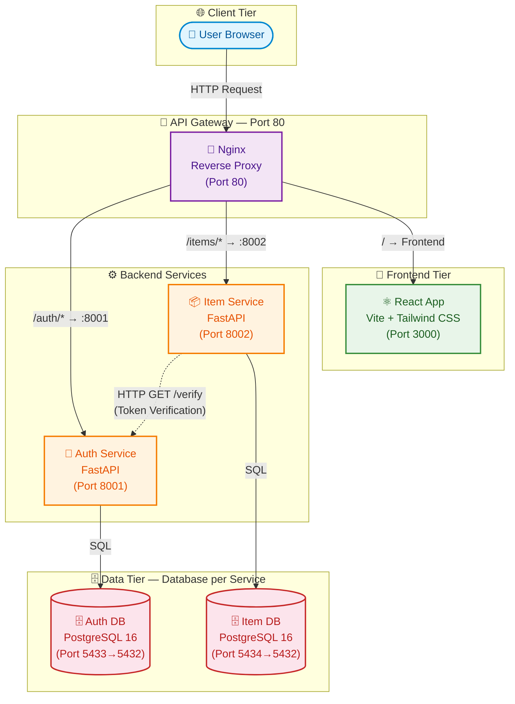
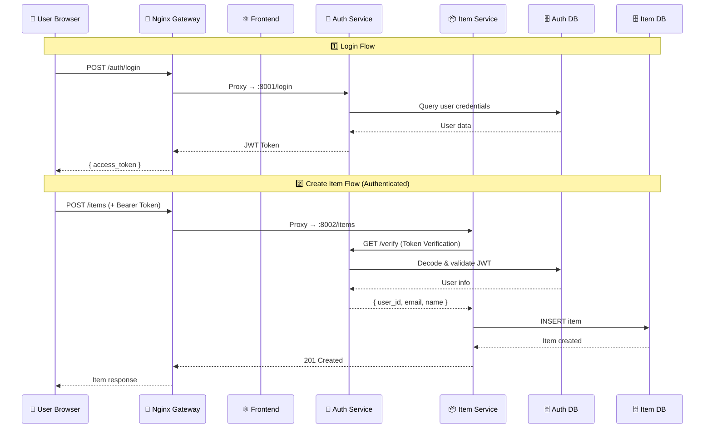
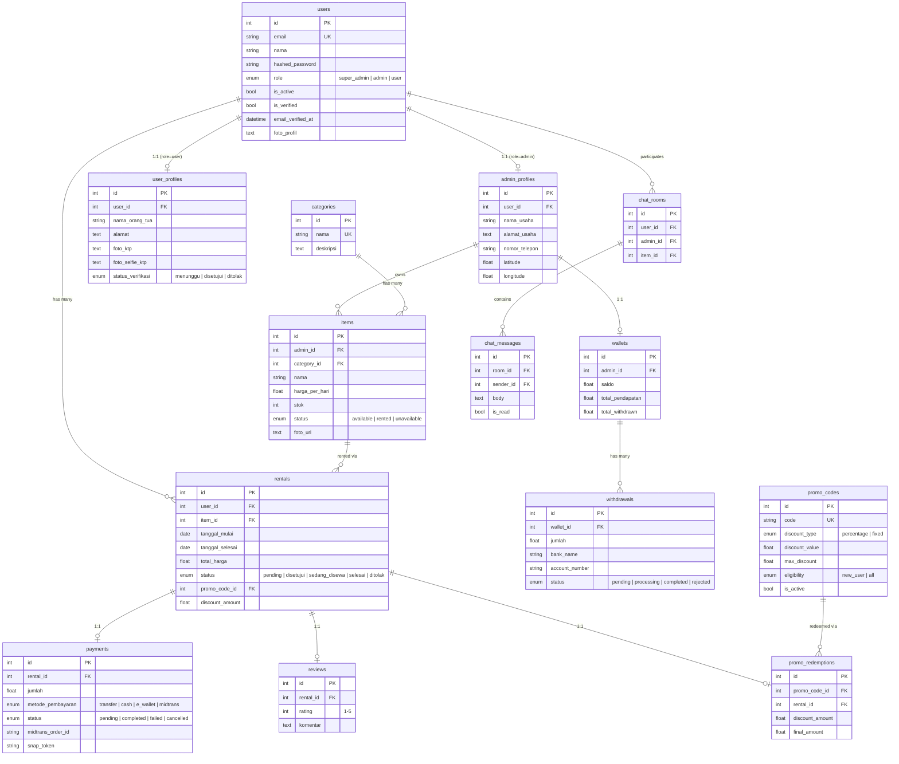
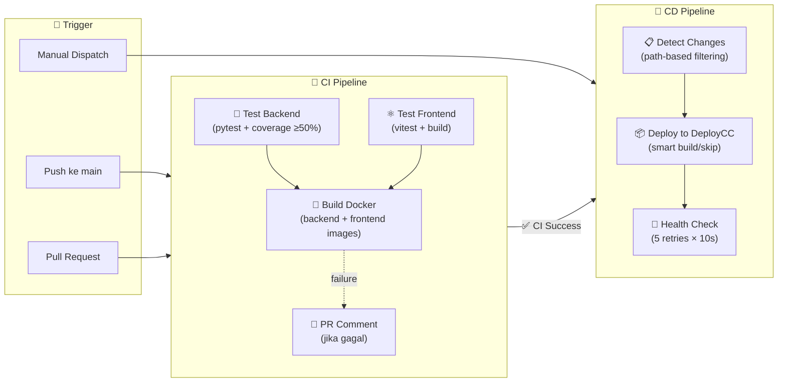

<p align="center">
  
</p>

<h1 align="center"><span style="color:#22c55e">Sewain</span> — Platform Sewa Barang Online</h1>


<p align="center">
  
  
  
  
  
  
  
  
</p>

<p align="center">
  <strong>Sewain</strong> adalah platform berbasis web yang memfasilitasi penyewaan barang secara online dengan arsitektur <strong>microservices</strong>, dikelola melalui Docker Compose, dan dideploy secara otomatis melalui <strong>CI/CD pipeline</strong> GitHub Actions.
</p>

<p align="center">
  <strong>Mata Kuliah:</strong> Komputasi Awan — Sistem Informasi, Institut Teknologi Kalimantan (ITK) &nbsp;|&nbsp; <strong>Tim:</strong> Kelompok Harahetta-2
</p>

<p align="center">
  🌐 <a href="https://cc-kelompok-harahetta-2.akhzafachrozy.my.id/">Live Demo</a> ·
  📋 <a href="https://cc-kelompok-harahetta-2.akhzafachrozy.my.id/api/docs#/">API Docs</a> ·
  📐 <a href="#-arsitektur-microservices">Arsitektur Detail</a>
</p>


---

## 📑 Daftar Isi

- [Deskripsi Aplikasi](#-deskripsi-aplikasi)
- [Tim Pengembang](#-tim-pengembang)
- [Fitur Utama](#-fitur-utama)
- [Tech Stack](#-tech-stack)
- [Arsitektur Microservices](#-arsitektur-microservices)
- [Database Schema](#-database-schema)
- [CI/CD Pipeline](#-cicd-pipeline)
- [Getting Started](#-getting-started)
- [Struktur Proyek](#-struktur-proyek)
- [API Documentation](#-api-documentation)
- [Testing](#-testing)
- [Makefile Commands](#-makefile-commands)
- [Roadmap](#-roadmap)

---

## 📝 Deskripsi Aplikasi

**SEWAIN** adalah platform penyewaan barang online yang menghubungkan **penyedia barang (Admin)** dengan **penyewa (User)** secara aman dan terstruktur. Platform ini dirancang untuk membantu pelaku usaha penyewaan — khususnya UMKM — dalam mendigitalisasi proses penyewaan yang selama ini dilakukan secara manual.

### Masalah yang Diselesaikan

| Masalah Konvensional | Solusi Sewain |
|---|---|
| Pencatatan manual rawan error | Sistem database terintegrasi dan otomatis |
| Jangkauan pelanggan terbatas | Platform online accessible 24/7 |
| Risiko penyalahgunaan barang | Verifikasi identitas KTP + selfie |
| Tidak ada transparansi status | Real-time tracking status penyewaan |
| Pembayaran tidak terstruktur | Integrasi payment gateway Midtrans |

---

## 👥 Tim Pengembang

| Nama | NIM | Peran | Tanggung Jawab |
|------|-----|-------|----------------|
| Djaky Abbyyu Fauzan Timumum | 10231032 | **Lead Backend** | Arsitektur API, database schema, business logic |
| Achmad Zaki Zaidan | 10231002 | **Lead Frontend** | UI/UX, React components, API integration |
| Muhammad Alif Setiawan | 10231056 | **Lead DevOps** | Docker, CI/CD, deployment, infrastructure |
| Riqqah Khalda Karina | 10231082 | **Lead QA & Docs** | Testing strategy, dokumentasi, quality assurance |

---

## ✨ Fitur Utama

SEWAIN memiliki **tiga peran pengguna** dengan hak akses yang berbeda:

### 👑 Super Admin
| Kategori | Fitur | Deskripsi |
|----------|-------|-----------|
| Manajemen Admin | Pengelolaan Penyedia | CRUD admin penyedia barang, aktivasi/nonaktifasi akun |
| Manajemen Konten | Pengelolaan Kategori | CRUD kategori barang (Elektronik, Outdoor, dll.) |
| Monitoring | Dashboard Statistik | Statistik platform, semua transaksi, verifikasi user |
| Promo | Pengelolaan Kupon | CRUD kode promo, diskon persentase/fixed, eligibility control |
| AI Assistant | Chatbot Monitoring | Monitoring aktivitas, ringkasan data, bantuan sistem |

### 🏪 Admin (Penyedia Barang)
| Kategori | Fitur | Deskripsi |
|----------|-------|-----------|
| Profil Usaha | Kelola Toko | Nama usaha, alamat, telepon, koordinat lokasi |
| Manajemen Produk | CRUD Barang | Tambah/edit/hapus barang, atur harga & stok, upload foto |
| Manajemen Order | Kontrol Sewa | Setujui/tolak permintaan, ubah status penyewaan |
| Pembayaran | Verifikasi Bayar | Konfirmasi pembayaran, wallet & withdrawal saldo |
| Chat | Live Chat | Komunikasi real-time dengan penyewa per item |
| AI Assistant | Chatbot Penyedia | Rekomendasi pengelolaan, respon otomatis |

### 👤 User (Penyewa)
| Kategori | Fitur | Deskripsi |
|----------|-------|-----------|
| Akun & Verifikasi | Registrasi + KYC | Registrasi, verifikasi email, upload KTP & selfie |
| Penyewaan | Proses Sewa | Katalog, detail barang, pilih tanggal, ajukan sewa |
| Pembayaran | Bayar Sewa | Pembayaran via Midtrans (QRIS, VA, e-wallet) |
| Monitoring | Status & Riwayat | Tracking status real-time, riwayat penyewaan |
| Review | Ulasan & Rating | Beri rating 1-5 dan komentar setelah sewa selesai |
| Promo | Kupon Diskon | Validasi & redeem kode promo saat checkout |
| Chat | Live Chat | Komunikasi langsung dengan penyedia barang |
| AI Assistant | Chatbot Bantuan | Rekomendasi barang, bantuan penggunaan |

---

## 🛠 Tech Stack

### Backend
| Teknologi | Versi | Fungsi |
|-----------|-------|--------|
| Python | 3.12 | Bahasa pemrograman utama |
| FastAPI | 0.115 | Framework REST API high-performance |
| Uvicorn | 0.30 | ASGI server untuk production |
| SQLAlchemy | 2.0 | ORM untuk database operations |
| PostgreSQL | 16 | Database relasional utama |
| Pydantic | 2.9 | Validasi data & schema API |
| python-jose | 3.3 | JWT token management |
| bcrypt | 4.0 | Password hashing |
| OpenAI SDK | ≥1.30 | AI chatbot integration |
| Midtrans Client | 1.4 | Payment gateway integration |
| WebSockets | 13.1 | Real-time chat communication |

### Frontend
| Teknologi | Versi | Fungsi |
|-----------|-------|--------|
| React | 19 | UI library utama |
| Vite | 7.3 | Build tool & dev server |
| React Router DOM | 7.14 | Client-side routing |
| Tailwind CSS | 3.4 | Utility-first styling |
| Radix UI | Latest | Accessible UI components |
| Framer Motion | 12.38 | Animasi & transisi |
| Lucide React | 1.8 | Icon library |
| Sonner | 2.0 | Toast notifications |
| Leaflet | 1.9 | Interactive maps (pickup location) |

### Infrastructure & DevOps
| Teknologi | Fungsi |
|-----------|--------|
| Docker & Docker Compose | Containerisasi & orkestrasi service |
| Nginx | API Gateway & reverse proxy |
| GitHub Actions | CI/CD automation |
| DeployCC | Production deployment platform |
| Pytest + pytest-cov | Backend testing & coverage |
| Vitest + Testing Library | Frontend testing |
| ESLint + Flake8 | Code linting |

---

## 🏗 Arsitektur Microservices

Sewain menggunakan arsitektur **microservices** dengan pola **Database per Service** dan **API Gateway** menggunakan Nginx sebagai reverse proxy tunggal.

### Diagram Arsitektur Docker Compose



### Pemetaan Service & Port

| Service | Port Host | Port Container | Image | Deskripsi |
|---------|-----------|----------------|-------|-----------|
| `gateway` | **80** | 80 | `nginx:alpine` | API Gateway — reverse proxy untuk semua request |
| `frontend` | — | 3000 | Custom build | React SPA — UI aplikasi |
| `auth-service` | — | 8001 | `python:3.12-slim` | Registrasi, login, JWT token verification |
| `item-service` | — | 8002 | `python:3.12-slim` | CRUD items, statistik inventaris |
| `auth-db` | — | 5432 | `postgres:16-alpine` | Database khusus kredensial pengguna |
| `item-db` | — | 5432 | `postgres:16-alpine` | Database khusus data barang |

### Pola Komunikasi Antar Service



### Routing Table (Nginx Gateway)

| Path Pattern | Target Service | Keterangan |
|---|---|---|
| `/auth/*` | `auth-service:8001` | Semua endpoint autentikasi |
| `/items/*` | `item-service:8002` | Semua endpoint items & statistik |
| `/health` | Gateway langsung | Health check aggregator |
| `/*` (default) | `frontend:3000` | Static files & SPA fallback |

---

## 🗄 Database Schema

Sewain menggunakan **12 tabel** dalam database utama (monolith backend) dengan relasi yang terstruktur:



---

## 🔄 CI/CD Pipeline

Sewain menggunakan **GitHub Actions** untuk otomatisasi build, testing, dan deployment secara end-to-end.

### Pipeline Overview



### CI Jobs Detail

| Job | Runner | Timeout | Deskripsi |
|-----|--------|---------|-----------|
| `test-backend` | Ubuntu Latest | 10 min | Python 3.12, pip cache, `pytest --cov-fail-under=50` |
| `test-frontend` | Ubuntu Latest | 10 min | Node.js 20, `vitest run` + `npm run build` |
| `build-docker` | Ubuntu Latest | 10 min | Build Docker image backend & frontend (needs test pass) |
| `notify-failure` | Ubuntu Latest | 5 min | Auto-comment di PR jika CI gagal |

### CD Smart Deploy

Pipeline CD melakukan **deteksi perubahan** untuk optimasi deployment:

| Perubahan Terdeteksi | Aksi |
|---|---|
| `frontend/**` (signifikan) | 🔨 Build ulang frontend |
| `frontend/README*`, `docs/**` | ⏭ Skip build (kosmetik) |
| `backend/requirements.txt` | 📦 Re-install dependencies |
| `backend/**` | 🔄 Restart Uvicorn |
| Tidak ada perubahan | ✋ Zero downtime |

---

## 🚀 Getting Started

### Prasyarat

| Requirement | Minimum | Keterangan |
|---|---|---|
| Docker | 24.0+ | Containerisasi seluruh stack |
| Docker Compose | 2.20+ | Orkestrasi multi-container |
| Git | 2.40+ | Version control |
| Python | 3.12+ | Development lokal backend (opsional) |
| Node.js | 20+ | Development lokal frontend (opsional) |

### 🐳 Menjalankan via Docker (Recommended)

```bash
# 1. Clone repositori
git clone https://github.com/aidilsaputrakirsan-classroom/cc-kelompok-harahetta-2.git

# 2. Masuk ke direktori proyek
cd cc-kelompok-harahetta-2

# 3. Build & jalankan semua service (microservices)
docker compose up -d --build

# 4. Cek status semua container
docker compose ps

# 5. Akses aplikasi
#    → http://localhost (melalui Nginx Gateway)
```

### 💻 Menjalankan Manual (Development)

**1. Database**
```bash
# Buat database di PostgreSQL lokal
createdb -U postgres data_sewain

# Import seed data (opsional)
psql -U postgres -d data_sewain -f docs/seed-data.sql
```

**2. Backend**
```bash
cd backend
cp .env.example .env          # Sesuaikan konfigurasi
pip install -r requirements.txt
uvicorn main:app --reload --port 8000
```

**3. Frontend**
```bash
cd frontend
cp .env.example .env.local    # Sesuaikan VITE_API_URL
npm install
npm run dev
```

### 🔗 Akses Service

| Service | URL | Keterangan |
|---------|-----|------------|
| 🌐 Aplikasi (Gateway) | `http://localhost` | Entry point utama via Nginx |
| ⚛️ Frontend (direct) | `http://localhost:3000` | Akses langsung React dev server |
| 📖 Swagger UI (via Gateway) | `http://localhost/api/docs` | **API Documentation** (monolith via /api/) |
| 📘 ReDoc (via Gateway) | `http://localhost/api/redoc` | API Documentation alternative |
| 🔐 Auth Service | `http://localhost:8001` | Microservice autentikasi |
| 📦 Item Service | `http://localhost:8002` | Microservice inventaris |

### 🔑 Akun Default (Seed Data)

| Role | Email | Password |
|------|-------|----------|
| Super Admin | `superadmin@sewain.id` | `superadmin123` |
| Admin | `admin@sewain.id` | `admin123` |
| User | `user@sewain.id` | `user123` |

---

## 📂 Struktur Proyek

```
cc-kelompok-harahetta-2/
│
├── 🔐 services/                    # Microservices (Docker Compose)
│   ├── auth-service/                # Authentication microservice
│   │   ├── main.py                  #   FastAPI app — register, login, verify
│   │   ├── models.py                #   SQLAlchemy User model
│   │   ├── schemas.py               #   Pydantic request/response schemas
│   │   ├── database.py              #   PostgreSQL connection (auth_db)
│   │   ├── Dockerfile               #   Python 3.12-slim, port 8001
│   │   ├── requirements.txt         #   Dependencies: fastapi, bcrypt, jwt
│   │   └── tests/                   #   Unit tests
│   │
│   ├── item-service/                # Inventory microservice
│   │   ├── main.py                  #   FastAPI app — CRUD items, stats
│   │   ├── auth_client.py           #   HTTP client → Auth Service /verify
│   │   ├── models.py                #   SQLAlchemy Item model
│   │   ├── schemas.py               #   Pydantic schemas
│   │   ├── database.py              #   PostgreSQL connection (item_db)
│   │   ├── Dockerfile               #   Python 3.12-slim, port 8002
│   │   ├── requirements.txt         #   Dependencies: fastapi, httpx
│   │   └── tests/                   #   Unit tests
│   │
│   └── gateway/                     # API Gateway
│       └── nginx.conf               #   Routing: /auth→8001, /items→8002, /→FE
│
├── ⚙️ backend/                      # Monolith Backend (full-featured)
│   ├── main.py                      #   FastAPI app — semua endpoint (2700+ lines)
│   ├── models.py                    #   12 tabel SQLAlchemy (users, items, rentals, dll.)
│   ├── schemas.py                   #   Request/Response Pydantic schemas
│   ├── crud.py                      #   Database operations layer
│   ├── auth.py                      #   JWT authentication & role guards
│   ├── config.py                    #   Environment-based configuration
│   ├── chat.py                      #   WebSocket chat (User ↔ Admin)
│   ├── chatbot.py                   #   AI chatbot integration (OpenAI)
│   ├── email_service.py             #   Email verification & password reset
│   ├── midtrans_service.py          #   Payment gateway integration
│   ├── database.py                  #   Database connection manager
│   ├── Dockerfile                   #   Multi-stage build
│   ├── requirements.txt             #   Python dependencies
│   └── tests/                       #   10 test files (pytest)
│       ├── conftest.py              #     Test fixtures & setup
│       ├── test_auth.py             #     Authentication tests
│       ├── test_admin.py            #     Admin endpoint tests
│       ├── test_items.py            #     Item CRUD tests
│       ├── test_categories.py       #     Category tests
│       ├── test_chat.py             #     Chat functionality tests
│       ├── test_reviews.py          #     Review system tests
│       ├── test_wallet.py           #     Wallet & withdrawal tests
│       ├── test_rental_due_at.py    #     Rental deadline tests
│       └── test_health.py           #     Health check tests
│
├── 🎨 frontend/                     # React SPA
│   ├── src/
│   │   ├── pages/                   #   21 halaman (Landing, Login, Dashboard, dll.)
│   │   ├── components/              #   20+ komponen reusable
│   │   │   ├── ui/                  #     Radix UI primitives
│   │   │   ├── __tests__/           #     Component tests
│   │   │   ├── ChatbotWidget.jsx    #     AI chatbot widget
│   │   │   ├── MapPicker.jsx        #     Leaflet map component
│   │   │   ├── PromoBanner.jsx      #     Promo display
│   │   │   └── ...
│   │   ├── context/                 #   AuthContext (global state)
│   │   ├── services/
│   │   │   ├── api.js               #     HTTP client (Axios-like)
│   │   │   └── chat.js              #     WebSocket chat client
│   │   ├── App.jsx                  #   Router & layout
│   │   └── main.jsx                 #   Entry point
│   ├── Dockerfile                   #   Multi-stage: build → nginx serve
│   ├── nginx.conf                   #   SPA fallback config
│   ├── package.json                 #   Node.js dependencies
│   └── vite.config.js               #   Vite build configuration
│
├── 📋 docs/                         #   Dokumentasi proyek
│   ├── architecture.md              #     Arsitektur microservices detail
│   ├── deployment-guide.md          #     Panduan deployment
│   ├── setup-guide.md               #     Panduan setup lengkap
│   ├── testing-guide.md             #     Strategi & panduan testing
│   ├── testing/                     #     Hasil testing (API, UI, Auth)
│   ├── seed-data.sql                #     Data awal database
│   └── img/                         #     Screenshots & gambar
│
├── 🔧 .github/
│   ├── workflows/
│   │   ├── ci.yml                   #   CI: test → build → notify
│   │   └── cd.yml                   #   CD: detect changes → deploy → health check
│   └── CODEOWNERS                   #   Auto-assign reviewers
│
├── docker-compose.yml               #   Microservices orchestration (6 containers)
├── docker-compose.prod.yml          #   Production overrides
├── Makefile                         #   Developer workflow shortcuts
└── README.md                        #   ← You are here
```

---

## 📖 API Documentation

### Endpoint Overview (Monolith Backend)

Sewain API memiliki **50+ endpoints** yang terorganisir dalam 10 kategori:

| Kategori | Prefix | Auth | Jumlah Endpoint |
|----------|--------|------|-----------------|
| 🔐 Auth | `/auth/*` | Public/Login | 7 (register, login, verify-email, forgot-password, dll.) |
| 👑 Super Admin | `/superadmin/*` | Super Admin | 8 (users CRUD, stats, verifications, rentals) |
| 🏪 Admin Profile | `/admin/profile` | Admin | 4 (CRUD profil usaha) |
| 📂 Kategori | `/categories` | Public/SA | 4 (GET public, CRUD super admin) |
| 📦 Items | `/items/*` | Login | 5 (katalog, detail, CRUD admin) |
| 📋 Rentals | `/rentals/*` | Verified User/Admin | 6 (ajukan sewa, status update, riwayat) |
| 💳 Payments | `/payments/*` | Login | 5 (create, verify, Midtrans webhook) |
| 💰 Wallet | `/admin/wallet/*` | Admin/SA | 4 (saldo, withdrawal, approval) |
| ⭐ Reviews | `/reviews/*` | User/Public | 4 (create, list, shop reviews) |
| 🎟️ Promo | `/promo/*` | User/SA | 5 (validate, redeem, CRUD codes) |
| 🤖 Chatbot | `/chatbot/*` | Login | 2 (send message, history) |
| 💬 Chat | `/chat/*` | Login | 5 (rooms, messages, WebSocket) |

### Microservices API Contract

| Method | Endpoint | Service | Deskripsi |
|--------|----------|---------|-----------|
| `POST` | `/auth/register` | Auth Service | Registrasi user baru |
| `POST` | `/auth/login` | Auth Service | Login, dapatkan JWT token |
| `GET` | `/auth/verify` | Auth Service | Internal — verifikasi token (inter-service) |
| `GET` | `/items` | Item Service | Daftar items milik user |
| `POST` | `/items` | Item Service | Tambah item baru (authenticated) |
| `GET` | `/items/{id}` | Item Service | Detail item |
| `PUT` | `/items/{id}` | Item Service | Update item |
| `DELETE` | `/items/{id}` | Item Service | Hapus item |
| `GET` | `/items/stats` | Item Service | Statistik items |

> 📖 Dokumentasi API lengkap tersedia di [Swagger UI](https://cc-kelompok-harahetta-2.akhzafachrozy.my.id/api/docs) dan file [docs/testing/api-documentation.md](./docs/testing/api-documentation.md)

---

## 🧪 Testing

### Testing Stack

| Layer | Tool | Runner | Coverage |
|-------|------|--------|----------|
| Backend Unit Tests | **Pytest** | GitHub Actions | ≥ 50% (enforced) |
| Backend Coverage | **pytest-cov** | GitHub Actions | `--cov-fail-under=50` |
| Frontend Unit Tests | **Vitest** | GitHub Actions | Component testing |
| Frontend Components | **Testing Library** | Vitest | React component testing |
| API Testing | Manual + Automated | Swagger UI / HTTPx | 10 endpoint scenarios |
| UI Integration | Manual | Browser | 10 UI scenarios |
| E2E | Manual | Browser | 9 end-to-end scenarios |

### Backend Test Suite (10 files)

```bash
# Jalankan semua test dengan coverage
cd backend
pytest --cov=. --cov-report=term-missing

# Test file yang tersedia:
# tests/test_auth.py          — Auth register, login, token
# tests/test_admin.py         — Admin profile CRUD
# tests/test_items.py         — Item CRUD operations
# tests/test_categories.py    — Category management
# tests/test_chat.py          — Chat rooms & messages
# tests/test_reviews.py       — Review & rating system
# tests/test_wallet.py        — Wallet & withdrawal
# tests/test_rental_due_at.py — Rental deadline logic
# tests/test_health.py        — Health check endpoint
```

### Frontend Test Suite

```bash
# Jalankan test
cd frontend
npm test

# Watch mode
npm run test:watch

# Dengan coverage
npm run test:coverage
```

### Hasil Testing Ringkasan

<details>
<summary><strong>📋 API Documentation Testing (10 Skenario)</strong></summary>

| No | Endpoint | Metode | Skenario | Status |
|----|----------|--------|----------|--------|
| 1 | `/health` | GET | Backend & database aktif | 🟢 Pass |
| 2 | `/auth/register` | POST | Registrasi akun baru | 🟢 Pass |
| 3 | `/auth/login` | POST | Login dengan akun valid | 🟢 Pass |
| 4 | `/auth/me` | GET | Ambil data user login | 🟢 Pass |
| 5 | `/categories` | GET | Menampilkan kategori | 🟢 Pass |
| 6 | `/items` | GET | Menampilkan katalog | 🟢 Pass |
| 7 | `/items` | POST | Menambah barang baru | 🟢 Pass |
| 8 | `/items/{id}` | PUT | Memperbarui barang | 🟢 Pass |
| 9 | `/items/{id}` | DELETE | Menghapus barang | 🟢 Pass |
| 10 | `/rentals` | POST | Membuat transaksi sewa | 🟢 Pass |

> Detail lengkap: [docs/testing/api-documentation.md](./docs/testing/api-documentation.md)

</details>

<details>
<summary><strong>🖥️ UI & API Integration Testing (10 Skenario)</strong></summary>

| No | Skenario | Hasil | Status |
|----|----------|-------|--------|
| 1 | Cek Status Koneksi | Dashboard dimuat, API Connected | ✅ Pass |
| 2 | Read Data Katalog | Item dari database tampil | ✅ Pass |
| 3 | Tambah Item Baru | Modal form muncul | ✅ Pass |
| 4 | Create & Upload | Data tersimpan, thumbnail muncul | ✅ Pass |
| 5 | Sync UI Post-Create | Item baru muncul otomatis | ✅ Pass |
| 6 | Edit Mode | Form terisi data lama | ✅ Pass |
| 7 | Update Data | Perubahan terupdate di UI | ✅ Pass |
| 8 | Search Feature | Filter sesuai kata kunci | ✅ Pass |
| 9 | Delete Item | Item terhapus dari UI & DB | ✅ Pass |
| 10 | Empty State | Pesan "Data tidak ditemukan" | ✅ Pass |

> Detail lengkap: [docs/testing/ui-test-result.md](./docs/testing/ui-test-result.md)

</details>

<details>
<summary><strong>🔐 Authentication & CRUD Testing (14 Skenario)</strong></summary>

**Authentication (5 skenario)**

| Kode | Skenario | Status |
|------|----------|--------|
| auth1 | Register User | ✅ Pass |
| auth2 | Validasi Register (field kosong) | ✅ Pass |
| auth3 | Login Berhasil | ✅ Pass |
| auth4 | Login Gagal (password salah) | ✅ Pass |
| auth5 | Logout | ✅ Pass |

**CRUD (5 skenario)**

| Kode | Skenario | Status |
|------|----------|--------|
| crud1 | Create Item | ✅ Pass |
| crud2 | Validasi Form (field wajib) | ✅ Pass |
| crud3 | Read Data | ✅ Pass |
| crud4 | Update Item | ✅ Pass |
| crud5 | Delete Item | ✅ Pass |

**End-to-End (9 skenario)**

| Kode | Skenario | Status |
|------|----------|--------|
| ee1 | Buka aplikasi → halaman login | ✅ Pass |
| ee2 | Register user | ✅ Pass |
| ee3 | Auto login setelah register | ✅ Pass |
| ee4 | Dashboard tampil | ✅ Pass |
| ee5 | Nama user di header | ✅ Pass |
| ee6 | CRUD berjalan | ✅ Pass |
| ee7 | Logout | ✅ Pass |
| ee8 | Login ulang | ✅ Pass |
| ee9 | Data tetap ada setelah re-login | ✅ Pass |

> Detail & screenshots: [docs/testing/auth-test-result/](./docs/testing/auth-test-result/)

</details>

---

## ⚡ Makefile Commands

Semua command dijalankan dari **root directory** proyek.

### Quick Reference

```bash
make help              # Tampilkan semua perintah tersedia
make compose-up        # 🚀 Jalankan semua services
make compose-down      # ⏹️ Stop semua services
make compose-build     # 🔨 Rebuild & jalankan
make compose-logs      # 📋 Log real-time semua services
make compose-ps        # 📊 Status semua services
make lint              # 🔍 Lint backend (flake8) + frontend (eslint)
make pr-check          # 🔎 Full pre-PR check (build + test)
```

### Daftar Lengkap

| Kategori | Command | Deskripsi |
|----------|---------|-----------|
| **Compose** | `compose-up` | Jalankan semua services (detached) |
| | `compose-down` | Stop semua services |
| | `compose-build` | Rebuild + jalankan semua |
| | `compose-logs` | Log real-time semua services |
| | `compose-ps` | Status semua services |
| | `compose-restart` | Restart semua services |
| | `compose-clean` | Hapus containers, networks, volumes |
| **Backend** | `build` | Build Docker image backend |
| | `run` | Jalankan container backend |
| | `push` | Push image ke Docker Hub |
| | `stop` | Stop & hapus container |
| | `logs` | Log real-time backend |
| | `health` | Health check `/health` |
| | `shell` | Masuk ke shell container |
| **Frontend** | `fe-build` | Build Docker image frontend |
| | `fe-push` | Push image ke Docker Hub |
| | `fe-run` | Jalankan container frontend |
| | `fe-stop` | Stop container frontend |
| | `fe-restart` | Rebuild + rerun frontend |
| **CI/CD** | `lint` | Jalankan flake8 + eslint |
| | `test` | Jalankan test suite |
| | `pr-check` | Build Docker + test (pre-PR gate) |
| **Push** | `push-all` | Push backend + frontend ke Docker Hub |

---

## 🗺 Roadmap

| Minggu | Target | Deliverables | Status |
|--------|--------|-------------|--------|
| 1 | Setup & Hello World | Project setup, hello world endpoint | ✅ Selesai |
| 2 | REST API + Database | CRUD endpoints, PostgreSQL integration | ✅ Selesai |
| 3 | React Frontend | UI pages, component architecture | ✅ Selesai |
| 4 | Full-Stack Integration | API integration, auth flow | ✅ Selesai |
| 5–7 | Docker & Compose | Containerisasi, multi-service | ✅ Selesai |
| 8 | UTS Demo | Presentasi tengah semester | ✅ Selesai |
| 9–11 | CI/CD Pipeline | GitHub Actions, automated testing | ✅ Selesai |
| 12–14 | Microservices | Service decomposition, API Gateway | ✅ Selesai |
| 15–16 | Final & UAS | Polish, documentation, final demo | 🔄 In Progress |

---

## 📄 Lisensi

Proyek ini dibuat untuk keperluan akademis mata kuliah **Komputasi Awan** — Program Studi Sistem Informasi, Institut Teknologi Kalimantan (ITK).

