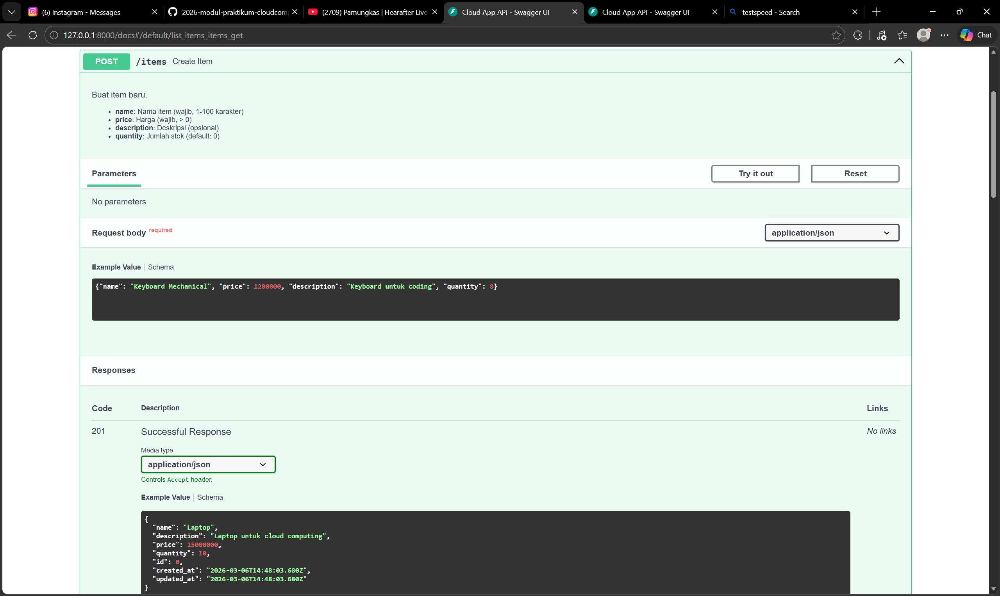
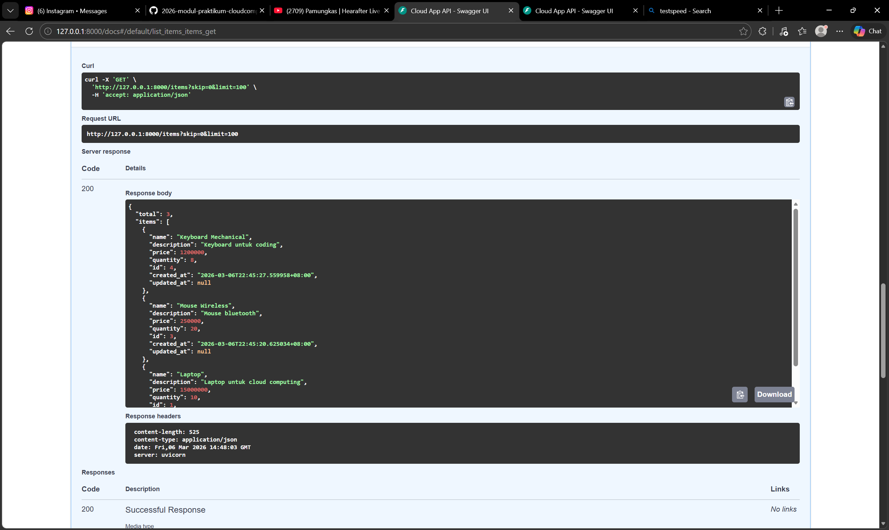
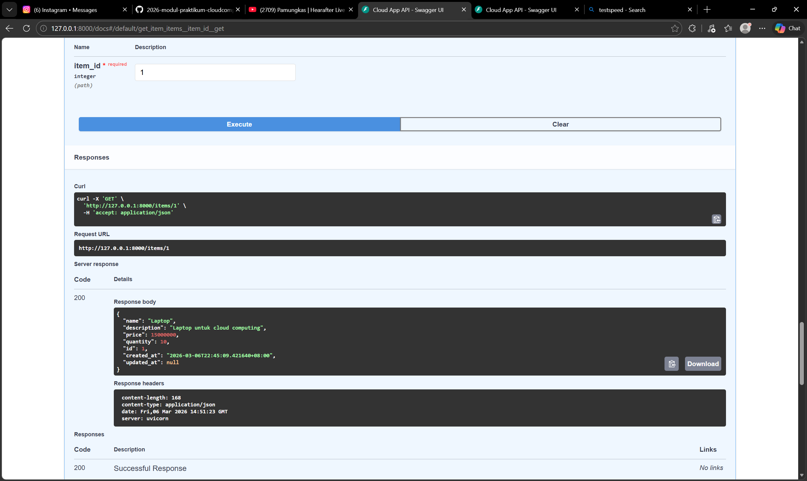
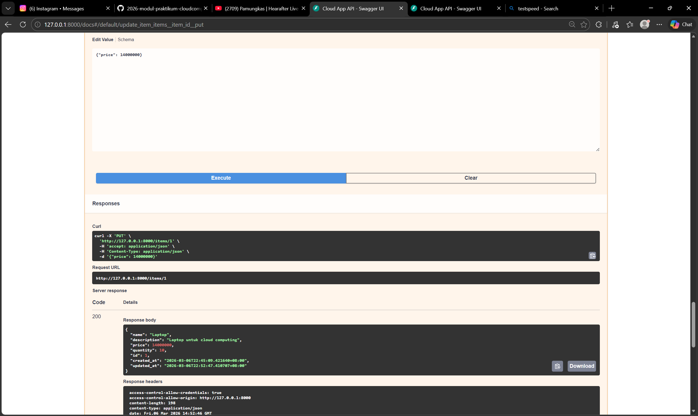
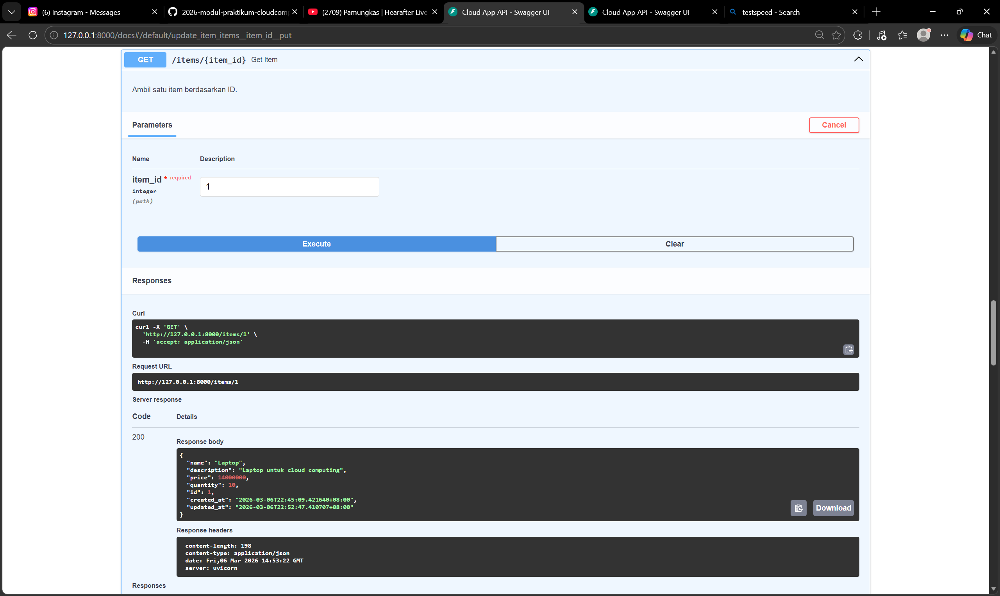
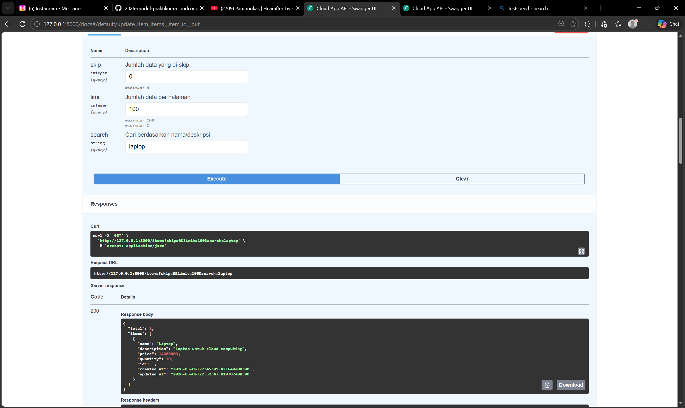
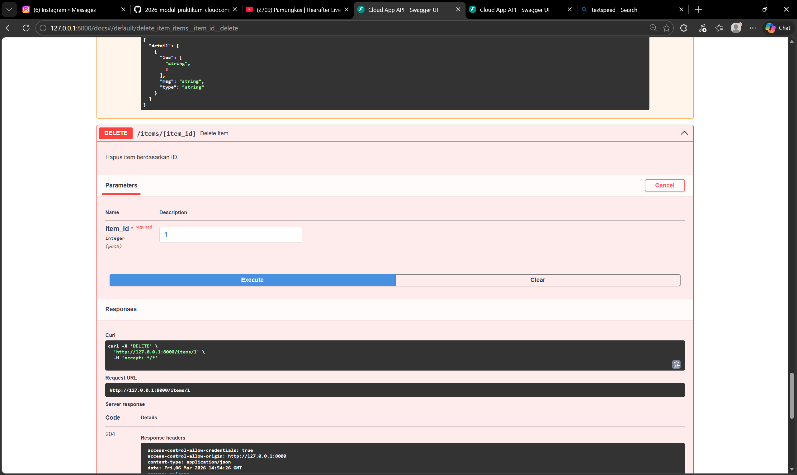
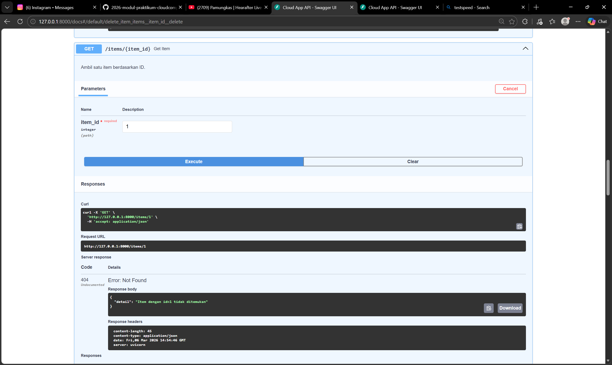
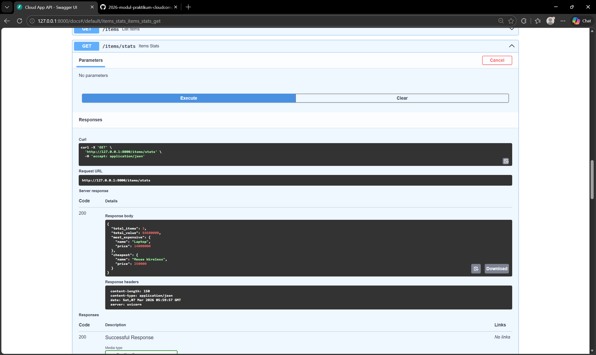

**1. POST /items** — Buat 3 item:
```json
{"name": "Laptop", "price": 15000000, "description": "Laptop untuk cloud computing", "quantity": 5}
```
```json
{"name": "Mouse Wireless", "price": 250000, "description": "Mouse bluetooth", "quantity": 20}
```
```json
{"name": "Keyboard Mechanical", "price": 1200000, "description": "Keyboard untuk coding", "quantity": 8}
```

**2. GET /items** — Harus mengembalikan 3 items dengan `total: 3`

**3. GET /items/1** — Harus mengembalikan item "Laptop"

**4. PUT /items/1** — Update harga:
```json
{"price": 14000000}
```

**5. GET /items/1** — Harga harus berubah ke 14000000

**6. GET /items?search=laptop** — Harus mengembalikan 1 item

**7. DELETE /items/1** — Harus response 204

**8. GET /items/1** — Harus response 404

**9. GET /items/stats** - Harus menampilkan status total items, total value (sum of price × quantity), item termahal, item termurah
