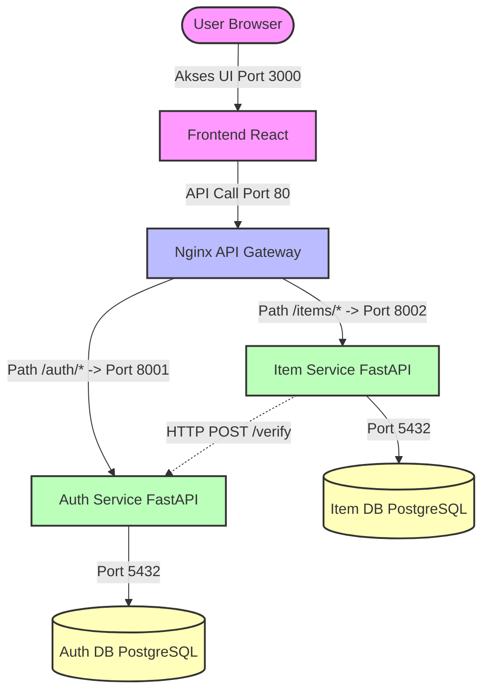

# Dokumentasi Arsitektur Microservices 

Dokumen ini menjelaskan arsitektur sistem baru setelah didekomposisi dari struktur Monolith menjadi Microservices, lengkap dengan pemetaan port, kontrak API (*API Contract*) dan panduan operasional lokal. Tujuan penyusunan dokumen arsitektur ini adalah sebagai berikut:

- Menjadi panduan utama bagi seluruh tim dalam memahami arsitektur sistem microservices.
- Menstandarkan integrasi antar layanan melalui API Contract yang disepakati bersama.
- Mempermudah proses kolaborasi dan konfigurasi lingkungan pengembangan lokal.
- Menjadi pedoman dalam pemeliharaan, monitoring, dan troubleshooting sistem.

---

## 1. Diagram Arsitektur Sistem

Berikut adalah visualisasi arsitektur sistem yang menggunakan Nginx sebagai API Gateway, membagi fungsionalitas aplikasi menjadi dua service utama (*Auth Service* dan *Item Service*) dengan database PostgreSQL yang saling terisolasi (*Database per Service*).



---

## 2. Daftar Service dan Alokasi Port

Aplikasi dipetakan menjadi 6 container yang berjalan di dalam jaringan Docker internal (`docker-compose.yml`). Berikut adalah spesifikasi port eksternal (*host*) dan port internal (*container*) untuk masing-masing layanan:

| Service | Port Host | Port Container | Deskripsi Fungsional                                              |
| --------------------- | ----------------- | -------------- | ----------------------------------------------------------------- |
| `gateway`   | 80                | 80             | Gerbang masuk utama (*reverse proxy*) untuk frontend dan backend. |
| `frontend`            | 3000              | 3000           | Aplikasi UI (React) yang berinteraksi dengan pengguna.            |
| `auth-service`        | 8001              | 8001           | Menangani registrasi, login, dan autentikasi token JWT.           |
| `item-service`        | 8002              | 8002           | Mengelola operasi CRUD data barang/item dan analisis statistik.   |
| `auth-db`             | 5433              | 5432           | Database PostgreSQL khusus untuk menyimpan kredensial pengguna.   |
| `item-db`             | 5434              | 5432           | Database PostgreSQL khusus untuk menyimpan data barang/item.      |

---

## 3. API Contract

Seluruh request dari client harus dikirim melalui API Gateway pada port `80`. Nginx akan meneruskan request secara otomatis ke service yang sesuai.

### Auth Service

Layanan ini berfungsi untuk mengelola autentikasi pengguna, seperti registrasi akun, login, serta verifikasi token JWT untuk menjaga keamanan akses sistem.

| Method | Endpoint Path    | Deskripsi Fungsional                                                                        |
| ------ | ---------------- | ------------------------------------------------------------------------------------------- |
| `POST` | `/auth/register` | Mendaftarkan akun pengguna baru ke dalam database `auth_db`.                                |
| `POST` | `/auth/login`    | Memvalidasi kredensial pengguna dan menghasilkan token akses JWT jika login berhasil.       |
| `POST` | `/auth/verify`   | Internal endpoint yang digunakan oleh Item Service untuk memverifikasi validitas token JWT. |


### Item Service

Layanan ini digunakan untuk mengelola data inventaris atau barang milik pengguna, mulai dari menambahkan, menampilkan, memperbarui, hingga menghapus data item.

| Method   | Endpoint Path      | Deskripsi Fungsional                                                                                                |
| -------- | ------------------ | ------------------------------------------------------------------------------------------------------------------- |
| `GET`    | `/items/`          | Mengambil seluruh daftar barang atau item milik pengguna.                                                           |
| `POST`   | `/items/`          | Menambahkan data barang atau item baru ke dalam database `item_db`.                                                 |
| `GET`    | `/items/{item_id}` | Mengambil detail satu data barang berdasarkan ID item.                                                              |
| `PUT`    | `/items/{item_id}` | Memperbarui informasi barang berdasarkan ID item.                                                                   |
| `DELETE` | `/items/{item_id}` | Menghapus data barang secara permanen berdasarkan ID item.                                                          |
| `GET`    | `/items/stats`     | Menampilkan hasil analisis statistik item, seperti total item, total kuantitas, harga rata-rata, dan item termahal. |

---

## 4. Panduan Menjalankan Sistem Secara Lokal

Panduan ini digunakan untuk membantu anggota tim atau pengguna baru menjalankan seluruh sistem microservices di komputer lokal.

### Prasyarat

Sebelum memulai, pastikan perangkat telah memenuhi kebutuhan berikut:

* Git telah terinstal untuk mengunduh kode program dari repositori.
* Docker dan Docker Desktop telah terinstal serta dalam kondisi aktif.
* Port `80`, `3000`, `8001`, dan `8002` tidak digunakan oleh aplikasi lain agar tidak terjadi konflik port.


### Langkah-Langkah Operasional

**1. Mengunduh Repository Proyek**

Buka Terminal, Git Bash, atau Command Prompt, lalu jalankan perintah berikut:

```bash 
git clone <URL_REPOSITORI_KANDIDAT_ANDA>
```

> Perintah ini digunakan untuk mengunduh seluruh source code proyek ke komputer lokal.

**2. Masuk ke Folder Proyek dan Berpindah Branch**

Masuk ke direktori proyek dan pindah ke branch microservices:

```bash 
cd <nama-folder-proyek>
git checkout docs/microservices-architecture
```

> Perintah `cd` digunakan untuk masuk ke folder utama proyek, sedangkan `git checkout` digunakan untuk memastikan penggunaan branch microservices terbaru.


**3. Menyiapkan File Environment**

Jika proyek menggunakan file konfigurasi environment, jalankan:

```bash 
cp .env.example .env
```

> Langkah ini digunakan untuk menyalin konfigurasi environment agar service dapat saling terhubung dengan benar.


**4. Build dan Menjalankan Container**

Jalankan perintah berikut:

```bash 
docker-compose up --build -d
```

> Perintah `up` digunakan untuk menjalankan seluruh service, `--build` untuk melakukan build ulang image agar perubahan terbaru diterapkan, dan `-d` untuk menjalankan container di background.


**5. Memeriksa Status Container**

Jalankan perintah berikut untuk memastikan semua service berjalan normal:

```bash 
docker-compose ps
```

> Pastikan seluruh container memiliki status `Up` atau `healthy`.


**6. Mengakses Service**

Jalankan perintah berikut untuk melihat log semua service:

```bash 
docker-compose logs -f
```


**7. Menghentikan Seluruh Layanan**

Jika pengembangan atau pengujian telah selesai, jalankan:

```bash 
docker-compose down
```

> Perintah ini digunakan untuk menghentikan seluruh container dan membebaskan kembali port yang digunakan sistem.

---

## 5. Panduan Pelacakan Kesalahan 

Panduan ini membantu melacak dan mengatasi error yang umum terjadi pada sistem microservices.


### A. Melihat Log Container

Gunakan perintah berikut untuk melihat log dari service tertentu.

**Log API Gateway (Nginx)**

```bash id="9dlyd8"
docker-compose logs -f gateway
```

> Digunakan untuk memeriksa masalah routing atau gateway.


**Log Auth Service**

```bash id="wkn14u"
docker-compose logs -f auth-service
```

> Digunakan untuk memeriksa error pada layanan autentikasi.


**Log Item Service**

```bash id="cgb1fy"
docker-compose logs -f item-service
```

> Digunakan untuk memeriksa error pada layanan item atau inventaris.


### B. Masalah Umum dan Solusi

| No | Permasalahan                                       | Penyebab                                                                    | Solusi                                                                                                                                                                        |
| -- | -------------------------------------------------- | --------------------------------------------------------------------------- | ----------------------------------------------------------------------------------------------------------------------------------------------------------------------------- |
| 1  | `Connection Refused` pada Item Service             | Konfigurasi `AUTH_SERVICE_URL` salah dan masih menggunakan `localhost`.     | Pastikan menggunakan nama service Docker.<br><br>Benar:<br>`AUTH_SERVICE_URL: http://auth-service:8001`<br><br>Salah:<br>`AUTH_SERVICE_URL: http://localhost:8001`            |
| 2  | Database Error: `Is the server running on host...` | Backend berjalan lebih cepat dibanding database.                            | Pastikan `depends_on` dan health check sudah digunakan pada `docker-compose.yml`. Jika masih error, jalankan:<br><br>`bash docker-compose restart auth-service item-service ` |
| 3  | Error `502 Bad Gateway`                            | Service backend mati atau crash.                                            | Periksa status container dengan:<br><br>`bash docker-compose ps `<br><br>Jika ada service `Exit`, cek log dengan:<br><br>`bash docker-compose logs <nama-service> `           |
| 4  | Error `CORS Blocked`                               | Frontend mengakses API langsung ke port backend atau CORS belum diaktifkan. | Pastikan frontend mengakses API melalui gateway `http://localhost/auth/...` dan tambahkan `CORSMiddleware` pada FastAPI.                                                      |
| 5  | Perubahan Database atau `.env` Tidak Berubah       | Docker masih menggunakan volume database lama.                              | Hapus volume lama lalu build ulang:<br><br>`bash docker-compose down -v` kemudian `docker-compose up --build -d `                                                                        |
| 6  | Error `401 Unauthorized` atau `403 Forbidden`      | Header Authorization salah atau token JWT sudah kedaluwarsa.                | Pastikan format header benar:<br><br>``javascript headers: { 'Authorization': `Bearer ${token}` } ``<br><br>Lakukan login ulang jika token sudah expired.                     |
