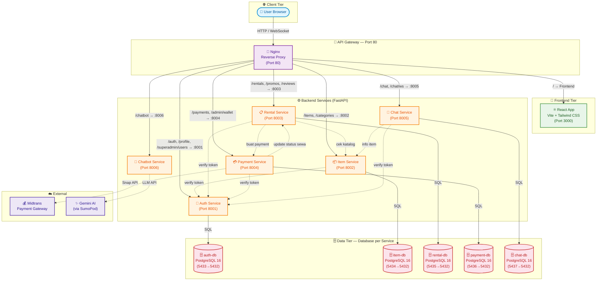

# Dokumentasi Arsitektur Microservices 

Dokumen ini menjelaskan arsitektur sistem Sewain setelah didekomposisi dari struktur Monolith menjadi Microservices, lengkap dengan pemetaan port, API Contract, dan panduan operasional lokal. Tujuan penyusunan dokumen arsitektur ini adalah sebagai berikut:

- Menjadi panduan utama bagi seluruh tim dalam memahami arsitektur sistem microservices.
- Menstandarkan integrasi antar layanan melalui API Contract yang disepakati bersama.
- Mempermudah proses kolaborasi dan konfigurasi lingkungan pengembangan lokal.
- Menjadi pedoman dalam pemeliharaan, monitoring, dan troubleshooting sistem.

---

## 1. Diagram Arsitektur Sistem

Berikut adalah visualisasi arsitektur microservices Sewain saat ini. Sistem menerapkan pola Database per Service dan API Gateway menggunakan Nginx sebagai reverse proxy tunggal. Sistem terdiri dari 6 backend service, 5 database terisolasi, frontend React, dan Nginx gateway yang diorkestrasi melalui Docker Compose — total 13 container.



---

## 2. Daftar Service dan Alokasi Port

Aplikasi dijalankan menggunakan Docker Compose dan beroperasi dalam jaringan internal yang terisolasi. Tabel berikut menunjukkan pemetaan port eksternal (host) dan port internal (container) untuk setiap layanan.

| Service / Container | Port Host | Port Container | Image / Build | Database | Deskripsi Fungsional |
|---------------------|-----------|---------------|---------------|----------|----------------------|
| gateway | 80 | 80 | nginx:alpine | — | API Gateway yang berfungsi sebagai reverse proxy tunggal untuk seluruh permintaan aplikasi. |
| frontend | — | 3000 | ./frontend | — | React Single Page Application (SPA) yang menyediakan antarmuka pengguna. |
| auth-service | — | 8001 | ./services/auth-service | auth-db | Menangani registrasi, login, JWT token, profil pengguna/admin, dan verifikasi KYC. |
| item-service | — | 8002 | ./services/item-service | item-db | Mengelola data barang, kategori, serta statistik inventaris. |
| rental-service | — | 8003 | ./services/rental-service | rental-db | Mengelola transaksi penyewaan, status rental, ulasan, dan kupon promosi. |
| payment-service | — | 8004 | ./services/payment-service | payment-db | Menangani pembayaran, integrasi Midtrans, dompet digital (wallet), dan penarikan saldo admin. |
| chat-service | — | 8005 | ./services/chat-service | chat-db | Menyediakan fitur chat room, pengiriman pesan, dan komunikasi real-time berbasis WebSocket antara pengguna dan admin. |
| chatbot-service | — | 8006 | ./services/chatbot-service | — (stateless) | Asisten AI Chatbot yang terintegrasi dengan model Gemini melalui SumoPod. |
| auth-db | 5433 | 5432 | postgres:16-alpine | — | Menyimpan data kredensial dan profil pengguna. |
| item-db | 5434 | 5432 | postgres:16-alpine | — | Menyimpan data barang dan kategori. |
| rental-db | 5435 | 5432 | postgres:16-alpine | — | Menyimpan data transaksi penyewaan, ulasan, dan kode promosi. |
| payment-db | 5436 | 5432 | postgres:16-alpine | — | Menyimpan data transaksi pembayaran dan saldo wallet admin. |
| chat-db | 5437 | 5432 | postgres:16-alpine | — | Menyimpan data ruang percakapan dan riwayat pesan. |

> **Catatan Port Database**: Port host untuk database dipetakan ke rentang **5433–5437** guna menghindari konflik dengan instans PostgreSQL lokal yang menggunakan port bawaan **5432** pada lingkungan pengembangan.
---

## 3. API Contract

Seluruh request dari client harus dikirim melalui API Gateway pada port `80`. Nginx akan meneruskan request secara otomatis ke service yang sesuai.

### A. Routing Table (Nginx Gateway Config)

| Path Pattern | Target Service | Keterangan |
|-------------|---------------|------------|
| `/auth/*` | `auth-service:8001` | Endpoint autentikasi (register, login, verify, dan sejenisnya). |
| `/profile`, `/admin/profile` | `auth-service:8001` | Profil pengguna dan informasi penyedia barang. |
| `/superadmin/users`, `/superadmin/verifications` | `auth-service:8001` | Manajemen pengguna dan verifikasi KYC. |
| `/items/*`, `/categories/*` | `item-service:8002` | Katalog barang, kategori, dan operasi CRUD barang. |
| `/rentals/*`, `/reviews/*`, `/promos/*` | `rental-service:8003` | Transaksi sewa, ulasan, dan validasi promo. |
| `/payments/*`, `/admin/wallet/*` | `payment-service:8004` | Pembayaran, wallet admin, dan webhook Midtrans. |
| `/chat/*` | `chat-service:8005` | REST API untuk chat room dan pesan. |
| `/chat/ws/*` | `chat-service:8005` | Koneksi WebSocket untuk komunikasi real-time. |
| `/chatbot/*` | `chatbot-service:8006` | Layanan asisten AI berbasis Gemini. |
| `/{service}/health` | Service terkait | Health check masing-masing service. |
| `/health` | Gateway | Health check agregasi seluruh sistem. |
| `/*` (default) | `frontend:3000` | React SPA dan berkas statis aplikasi. |


### B. Microservices API Contract

#### 1. Auth Service

Layanan ini berfungsi untuk mengelola autentikasi pengguna, otorisasi berbasis peran, data profil pengguna, serta proses verifikasi data KYC (*Know Your Customer*).

| Method | Endpoint Path | Auth Level | Deskripsi Fungsional |
|----------|-------------|------------|----------------------|
| POST | `/auth/register` | Public | Registrasi akun baru (User/Admin). |
| POST | `/auth/login` | Public | Login pengguna dan menghasilkan JWT token. |
| GET | `/auth/verify` | Internal | Verifikasi validitas JWT untuk komunikasi antar-service. |
| GET | `/profile` | User/Admin | Mengambil data profil pengguna yang sedang login. |
| POST | `/profile/kyc` | User | Mengunggah dokumen KYC (KTP dan selfie). |
| GET | `/superadmin/users` | Super Admin | Mengambil daftar seluruh pengguna. |
| POST | `/superadmin/verifications/{id}` | Super Admin | Menyetujui atau menolak pengajuan KYC. |


#### 2. Item Service

Layanan ini digunakan untuk mengelola inventaris barang, kategori barang, dan informasi aset yang tersedia untuk disewakan.

| Method | Endpoint Path | Auth Level | Deskripsi Fungsional |
|----------|-------------|------------|----------------------|
| GET | `/items` | Public | Mengambil katalog barang dengan pencarian dan filter. |
| GET | `/items/{id}` | Public | Mengambil detail satu barang tertentu. |
| POST | `/admin/items` | Admin | Menambahkan barang baru. |
| PUT | `/admin/items/{id}` | Admin | Memperbarui informasi barang. |
| DELETE | `/admin/items/{id}` | Admin | Menghapus barang dari katalog. |
| GET | `/categories` | Public | Mengambil daftar kategori barang. |


#### 3. Rental Service 

Layanan ini digunakan untuk mengelola proses penyewaan barang, validasi promo, serta ulasan pengguna terhadap barang yang telah disewa.

| Method | Endpoint Path | Auth Level | Deskripsi Fungsional |
|----------|-------------|------------|----------------------|
| POST | `/rentals` | Verified User | Mengajukan penyewaan barang. |
| GET | `/rentals` | Verified User | Mengambil riwayat penyewaan pengguna. |
| GET | `/admin/rentals` | Admin | Melihat seluruh permintaan sewa. |
| PATCH | `/admin/rentals/{id}/status` | Admin | Mengubah status transaksi sewa. |
| POST | `/promos/validate` | Verified User | Memvalidasi kode promo sebelum checkout. |
| POST | `/reviews` | Verified User | Memberikan rating dan ulasan setelah transaksi selesai. |


#### 4. Payment Service 

Layanan ini digunakan untuk mengelola pembayaran digital, saldo wallet admin, dan proses pencairan dana.

| Method | Endpoint Path | Auth Level | Deskripsi Fungsional |
|----------|-------------|------------|----------------------|
| POST | `/payments` | Verified User | Membuat transaksi pembayaran dan menghasilkan Snap Token Midtrans. |
| POST | `/payments/notification` | Public (Webhook) | Endpoint webhook notifikasi transaksi dari Midtrans. |
| GET | `/admin/wallet` | Admin | Mengambil informasi saldo wallet dan pendapatan. |
| POST | `/admin/wallet/withdraw` | Admin | Mengajukan penarikan dana ke rekening bank. |
| GET | `/superadmin/withdrawals` | Super Admin | Mengelola permintaan pencairan dana admin. |


#### 5. Chat Service 

Layanan ini menyediakan komunikasi real-time antara penyewa dan penyedia barang menggunakan REST API dan WebSocket.

| Method | Endpoint Path | Auth Level | Deskripsi Fungsional |
|----------|-------------|------------|----------------------|
| GET | `/chat/rooms` | User/Admin | Mengambil daftar ruang percakapan aktif. |
| POST | `/chat/rooms` | User/Admin | Membuat ruang percakapan baru. |
| GET | `/chat/rooms/{room_id}/messages` | User/Admin | Mengambil riwayat pesan dalam ruang percakapan. |
| WS | `/chat/ws/{room_id}` | User/Admin | Koneksi WebSocket untuk komunikasi real-time. |


#### 6. Chatbot Service 

Layanan ini menyediakan layanan asisten virtual berbasis Large Language Model (LLM) untuk membantu pengguna dalam menggunakan platform.

| Method | Endpoint Path | Auth Level | Deskripsi Fungsional |
|----------|-------------|------------|----------------------|
| POST | `/chatbot/ask` | User/Admin | Mengirim pertanyaan ke AI dan menerima jawaban. |
| GET | `/chatbot/history` | User/Admin | Mengambil riwayat percakapan pengguna dengan AI. |
---


## 4. Panduan Menjalankan Sistem Secara Lokal

Panduan ini digunakan untuk membantu anggota tim atau pengguna baru menjalankan seluruh sistem microservices di komputer lokal.

### Prasyarat

Sebelum memulai, pastikan perangkat telah memenuhi kebutuhan berikut:

* Git telah terinstal untuk mengunduh kode program dari repositori.
* Docker dan Docker Desktop telah terinstal serta dalam kondisi aktif.
* Port `80` dan `3000` tidak digunakan oleh aplikasi lain agar tidak terjadi konflik port.


### Langkah-Langkah Operasional

**1. Mengunduh Repository Proyek**

Buka Terminal, Git Bash, atau Command Prompt, lalu jalankan perintah berikut:

```bash 
git clone [https://github.com/aidilsaputrakirsan-classroom/cc-kelompok-harahetta-2.git](https://github.com/aidilsaputrakirsan-classroom/cc-kelompok-harahetta-2.git)
cd cc-kelompok-harahetta-2
```

> Perintah ini digunakan untuk mengunduh seluruh source code proyek ke komputer lokal.


**2. Menyiapkan File Environment**

Jika proyek menggunakan file konfigurasi environment, jalankan:

```bash 
cp .env.example .env
```

> Langkah ini digunakan untuk menyalin konfigurasi environment agar service dapat saling terhubung dengan benar.


**3. Build dan Menjalankan Container**

Jalankan perintah berikut:

```bash 
docker-compose up --build -d
```

> Perintah `up` digunakan untuk menjalankan seluruh service, `--build` untuk melakukan build ulang image agar perubahan terbaru diterapkan, dan `-d` untuk menjalankan container di background.


**4. Memeriksa Status Container**

Jalankan perintah berikut untuk memastikan semua service berjalan normal:

```bash 
docker-compose ps
```

> Pastikan seluruh container memiliki status `Up` atau `healthy`.


**5. Menghentikan Seluruh Layanan**

Jika pengembangan atau pengujian telah selesai, jalankan:

```bash 
docker-compose down
```

> Perintah ini digunakan untuk menghentikan seluruh container dan membebaskan kembali port yang digunakan sistem.

---

## 5. Panduan Pelacakan Kesalahan 

Panduan ini membantu melacak dan mengatasi error yang umum terjadi pada sistem microservices.


### A. Melihat Log Container

Gunakan perintah berikut untuk melihat log dari service tertentu.

**Log API Gateway (Nginx)**

```bash 
docker-compose logs -f gateway
```

**Log Auth Service**

```bash 
docker-compose logs -f auth-service
```

**Log Item Service**

```bash 
docker-compose logs -f item-service
```

**Log Kendala Transaksi Sewa & Promo**
```bash
docker compose logs -f rental-service
```

**Log Kendala Midtrans Webhook & Saldo Wallet**
```bash
docker compose logs -f payment-service
```

**Log Kendala Koneksi WebSocket Chat**
```bash
docker compose logs -f chat-service
```

**Log Kendala API LLM Gemini**
```bash
docker compose logs -f chatbot-service
```

### B. Masalah Umum dan Solusi

| No | Permasalahan                                       | Penyebab                                                                    | Solusi                                                                                                                                                                        |
| -- | -------------------------------------------------- | --------------------------------------------------------------------------- | ----------------------------------------------------------------------------------------------------------------------------------------------------------------------------- |
| 1  | `Connection Refused` pada Item Service             | Konfigurasi `AUTH_SERVICE_URL` salah dan masih menggunakan `localhost`.     | Pastikan menggunakan nama service Docker.<br><br>Benar:<br>`AUTH_SERVICE_URL: http://auth-service:8001`<br><br>Salah:<br>`AUTH_SERVICE_URL: http://localhost:8001`            |
| 2  | Perubahan kode program tidak terefleksi di browser             | Docker masih menggunakan volume database atau image lama yang di-cache.     | Lakukan pembersihan paksa cache volume dan build ulang: <br>`docker compose down -v` <br> `docker compose up -d --build`            |
| 3  | Error `502 Bad Gateway`                            | Service backend mati atau crash.                                            | Periksa status container dengan:<br><br>`bash docker-compose ps `<br><br>Jika ada service `Exit`, cek log dengan:<br><br>`bash docker-compose logs <nama-service> `           |
| 4  | Error `CORS Blocked`                               | Frontend mengakses API langsung ke port backend atau CORS belum diaktifkan. | Pastikan frontend mengakses API melalui gateway `http://localhost/auth/...` dan tambahkan `CORSMiddleware` pada FastAPI.                                                      |
| 5  | Perubahan Database atau `.env` Tidak Berubah       | Docker masih menggunakan volume database lama.                              | Hapus volume lama lalu build ulang:<br><br>`bash docker-compose down -v` kemudian `docker-compose up --build -d `  melalui gateway `http://localhost/auth/...` dan tambahkan `CORSMiddleware` pada FastAPI.                                                      |
| 6  | Jawaban Chatbot Kosong / Error       | chatbot-service tidak dapat menghubungi server Gemini atau kuota API Key habis.                              | Periksa apakah kunci API Gemini pada .env telah dikonfigurasi dengan benar. Pastikan kontainer chatbot memiliki akses internet keluar.                                                                     |