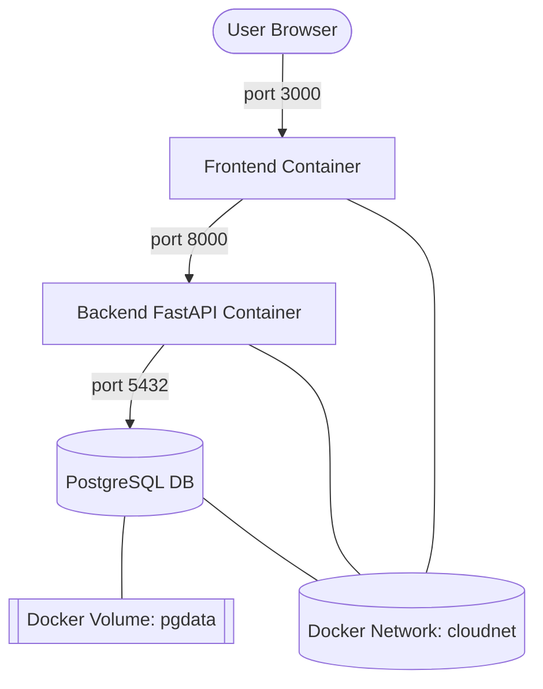

# 📑 Laporan Docker Architecture : Modul 6

---

## 1. Arsitektur Sistem (Docker Network)

Sistem ini terdiri dari tiga layanan utama. Seluruh layanan dijalankan di dalam Docker Custom Network bernama cloudnet untuk memastikan isolasi dan keamanan komunikasi.

### Diagram Arsitektur (Mermaid)



---

## 2. Detail Konfigurasi Container

| Komponen   | Image Name           | Port (Host:Cont) | Network   | Env Vars Kunci |
|------------|----------------------|------------------|-----------|---------|
| Frontend   | `sewain-frontend:v1` | 3000:80          | cloudnet  | -       |
| Backend    | `sewain-backend:v2`  | 8000:8000        | cloudnet  | `DATABASE_URL=postgresql://postgres:postgres@db:5432/cloudapp` |
| Database   | `postgres:16-alpine` | 15432:5432       | cloudnet  | `POSTGRES_PASSWORD=postgres, POSTGRES_DB=cloudapp` |

---

## 3. Docker Volumes

Data database PostgreSQL disimpan di dalam named volume pgdata.

- Path di Container: `/var/lib/postgresql/data`
- Keuntungan: Data tidak hilang meskipun container di-restart atau dihapus (`docker rm`).

---

## 4. Cara Menjalankan (Quick Start)

Gunakan urutan perintah berikut untuk menjalankan sistem secara keseluruhan:

```bash
# 1. Persiapan Jaringan & Volume
docker network create cloudnet
docker volume create pgdata

# 2. Menjalankan Database
docker run -d --name db --network cloudnet -v pgdata:/var/lib/postgresql/data \
-e POSTGRES_PASSWORD=postgres \
-e POSTGRES_DB=cloudapp \
-p 5433:5432 postgres:16-alpine

# 3. Menjalankan Backend
docker run -d --name backend --network cloudnet \
--env-file .env \
-p 8000:8000 cloudapp-backend:v1

# 4. Menjalankan Frontend
docker run -d --name frontend --network cloudnet \
-p 3000:80 cloudapp-frontend:v1
```

---