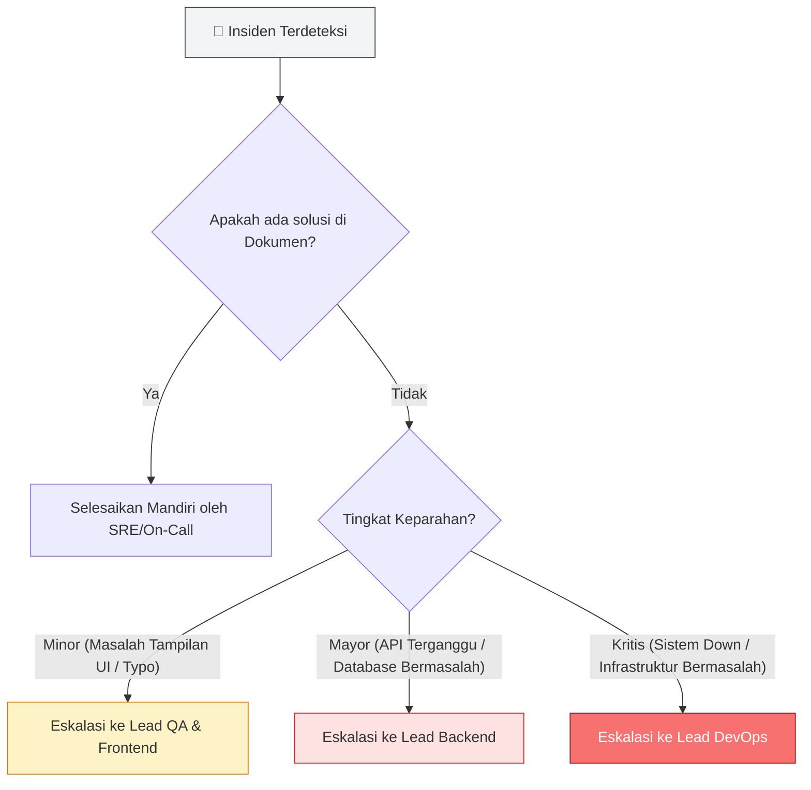

# 🛠️ Operations Guide — Sewain Platform (Kelompok Harahetta-2)


## 1. Overview 

Dokumen ini digunakan untuk membantu tim memantau kondisi sistem, melihat log, melacak request, memeriksa metrics, dan menangani masalah yang sering terjadi pada aplikasi microservices.

### Arsitektur Monitoring

Platform Sewain terdiri dari **13 services** yang berjalan dalam Docker Compose. Setiap service memiliki:

- **Health endpoint** (`/health`) untuk liveness check
- **Structured logging** (JSON format) untuk tracing
- **Correlation ID** untuk request tracking end-to-end

### Service Dependencies

```
Client Browser
    │
    ↓
Nginx Gateway (port 80)
    │
    ├─→ Auth Service (port 8001) ↔ auth-db (port 5433)
    ├─→ Item Service (port 8002) ↔ item-db (port 5434)
    ├─→ Rental Service (port 8003) ↔ rental-db (port 5435)
    ├─→ Payment Service (port 8004) ↔ payment-db (port 5436)
    ├─→ Chat Service (port 8005) ↔ chat-db (port 5437)
    ├─→ Chatbot Service (port 8006)
    └─→ Frontend (port 3000) — static/SPA
```

---

## 2. Health Check

### 2.1 Check Individual Service Health

**Endpoint Pattern:** `http://<service-host>:<port>/health`

#### Gateway (Nginx)
```bash
curl -i http://localhost:80/health
```

**Expected Response:**
```json
HTTP/1.1 200 OK

{
  "status": "healthy",
  "timestamp": "2026-06-10T10:30:45Z",
  "services": {
    "auth-service": "UP",
    "item-service": "UP",
    "rental-service": "UP",
    "payment-service": "UP",
    "chat-service": "UP",
    "chatbot-service": "UP",
    "database": "UP"
  }
}
```

#### Auth Service
```bash
curl -i http://localhost:8001/health
```

#### Item Service
```bash
curl -i http://localhost:8002/health
```

#### Chat Service
```bash
curl -i http://localhost:8005/health
```

**Troubleshooting Health Endpoint:**

| Status Code | Makna | Aksi |
|-------------|-------|------|
| 200 | Service sehat | Normal operation |
| 500 | Internal server error | Check service logs |
| 503 | Database unavailable | Check DB connection |
| Connection timeout | Service down | Restart container |

### 2.2 Docker Container Health Check

```bash
# Lihat status semua container
docker-compose ps

# Expected output:
# NAME              STATUS         PORTS
# gateway           Up (healthy)   80->80/tcp
# auth-service      Up (healthy)   8001->8001/tcp
# item-service      Up (healthy)   8002->8002/tcp
# ... dan seterusnya

# Lihat health check detail service tertentu
docker inspect sewain-auth-service | grep -A 5 '"Health"'
```

---

## 3. Membaca & Analisis Log

### 3.1 View Real-Time Logs

#### Log Gateway
```bash
docker-compose logs -f gateway
```

#### Log Auth Service
```bash
docker-compose logs -f auth-service
```

#### Log Item Service
```bash
docker-compose logs -f item-service
```

#### Log All Services (with timestamps)
```bash
docker-compose logs -f --timestamps
```

#### Log dengan filter (last 100 lines)
```bash
docker-compose logs --tail=100 service-name
```

### 3.2 Log Format Structure

Setiap log entry dari FastAPI service mengikuti format JSON:

```json
{
  "timestamp": "2026-06-10T10:30:45.123456Z",
  "level": "INFO",
  "logger": "sewain.auth",
  "message": "User login successful",
  "correlation_id": "req-8f3c9d2e-1a7b-4c5d-9e8f-7a6b5c4d3e2f",
  "user_id": 42,
  "method": "POST",
  "path": "/auth/login",
  "status_code": 200,
  "response_time_ms": 145,
  "service": "auth-service"
}
```

---

## 4. Request Tracing dengan Correlation ID

### 4.1 Correlation ID Concept

**Correlation ID** adalah unique identifier untuk melacak satu user request melalui semua services dan databases. Memudahkan debugging issues yang melibatkan multiple services.

**Flow:**
```
Client Browser
    │
    ├─ Request + Header X-Correlation-ID (atau auto-generated)
    │
    ↓
Nginx Gateway
    ├─ Generate/Preserve Correlation ID
    ├─ Add to response header
    │
    ↓
Auth Service
    ├─ Log dengan Correlation ID
    ├─ Pass to Item Service (if needed)
    │
    ↓
Item Service
    ├─ Log dengan sama Correlation ID
    │
    ↓
Database
    ├─ Query logged dengan Correlation ID
```

### 4.2 Extract Correlation ID dari Response

```bash
# Single request
curl -i http://localhost/items

# Look for header:
# X-Correlation-ID: req-8f3c9d2e-1a7b-4c5d-9e8f-7a6b5c4d3e2f
```

### 4.3 Trace Request End-to-End

**Scenario:** User report "Checkout failed"

```bash
# 1. Get Correlation ID from user/client logs
CORR_ID="req-8f3c9d2e-1a7b-4c5d-9e8f-7a6b5c4d3e2f"

# 2. Search all service logs untuk Correlation ID
docker-compose logs --no-color | jq --arg id "$CORR_ID" 'select(.correlation_id==$id)' | sort -k1

# Output akan menunjukkan:
# 10:30:45.123 - Gateway: Received POST /rentals
# 10:30:45.145 - Auth Service: Verified token
# 10:30:45.200 - Item Service: Checked stock
# 10:30:45.250 - Payment Service: Created payment
# 10:30:45.300 - Payment Service: Midtrans charge failed (insufficient balance)
# 10:30:45.350 - Gateway: Returned 402 (Payment Required)
```

---

## 5. Check Metrics

Metrics digunakan untuk memantau performa dan kesehatan sistem secara keseluruhan.

### 5.1 Melihat Metrics Aplikasi

Jalankan perintah berikut untuk melihat metrics terbaru:

```bash
./scripts/logs.sh metrics
```

atau akses endpoint metrics pada masing-masing service:

```bash
curl http://localhost/auth/metrics
curl http://localhost/items/metrics
```


### 5.2 Metrics yang Perlu Diperhatikan

#### Total Requests

Menunjukkan jumlah request yang diterima oleh service.

Contoh:

```json
{
  "total_requests": 150
}
```

Nilai ini membantu mengetahui seberapa besar trafik yang diterima aplikasi.


#### Error Rate

Menunjukkan persentase request yang gagal.

Contoh:

```json
{
  "error_rate_percent": 2.0
}
```

Panduan:

* < 1% → Normal
* 1% - 5% → Perlu dipantau
* > 5% → Perlu investigasi


#### Response Time (Latency)

Menunjukkan kecepatan service dalam merespons request.

Contoh:

```json
{
  "latency": {
    "p50_ms": 120,
    "p95_ms": 450,
    "p99_ms": 900
  }
}
```

Panduan:

* p50 → Kecepatan rata-rata pengguna
* p95 → Kecepatan mayoritas pengguna
* p99 → Kecepatan pada kondisi terburuk

Jika nilai p95 melebihi 1000 ms, lakukan pengecekan log dan penggunaan resource.


#### Status Code

Menunjukkan jumlah respons berdasarkan kode HTTP.

Contoh:

```json
{
  "status_codes": {
    "200": 120,
    "201": 20,
    "404": 5,
    "500": 5
  }
}
```

Panduan:

* Kode 2xx → Berhasil
* Kode 4xx → Kesalahan dari client
* Kode 5xx → Kesalahan dari server

Jika jumlah 5xx meningkat, segera periksa log aplikasi.


#### Memantau Resource Container

Gunakan perintah berikut untuk melihat penggunaan CPU dan memori setiap container:

```bash
docker stats
```

Perhatikan indikator berikut:

| Metric       | Kondisi Normal | Perlu Investigasi    |
| ------------ | -------------- | -------------------- |
| CPU Usage    | < 80%          | > 80%                |
| Memory Usage | < 85%          | > 85%                |
| Memory Usage | < 95%          | Risiko Out of Memory |

Jika penggunaan CPU atau memori tinggi dalam waktu lama, periksa log service terkait dan pertimbangkan untuk me-restart container.

---

## 6. Common Troubleshooting

### Issue 1: "Database Connection Refused"

**Error Condition:**
```
ERROR: could not connect to server: Connection refused
```

**Root Causes & Solutions:**

| Penyebab | Diagnosis | Solusi |
|----------|-----------|--------|
| Database container down | `docker-compose ps \| grep auth-db` shows "Down" | `docker-compose up -d auth-db` |
| Wrong port | Menggunakan port 5432 instead of 5433 | Check `docker-compose.yml`, gunakan port yang benar |
| Wrong credentials | Password salah di .env | Update .env dengan credentials yang benar |
| Network issues | Container tidak bisa reach database | Pastikan services di same network: `docker network ls` |

**Recovery:**
```bash
# 1. Restart database
docker-compose restart auth-db

# 2. Restart dependent service
docker-compose restart auth-service

# 3. Verify connection
docker-compose exec auth-service psql -h auth-db -U postgres -d auth_db -c "SELECT 1"
```

### Issue 2: "Authentication Failed / Invalid Token"

**Error Condition:**
```json
{
  "status_code": 401,
  "detail": "Token tidak valid atau sudah expired"
}
```

**Diagnosis:**

```bash
# Check logs
docker-compose logs auth-service | grep "token"

# Manually decode token (if JWT)
# Use https://jwt.io and paste token

# Check if SECRET_KEY dalam .env sudah changed
grep SECRET_KEY backend/.env
```

**Solutions:**
- Token expired → User login ulang
- SECRET_KEY berubah di production → Semua token invalid, user login ulang
- Invalid signature → Check SECRET_KEY consistency across services

### Issue 3: "Disk Space Full"

**Error Condition:**
```
docker-compose up failed / No space left on device
```

**Diagnosis:**

```bash
# Check disk usage
df -h

# Check Docker usage
docker system df
```

**Solutions:**
```bash
# Clean up unused images
docker image prune -a

# Remove old containers
docker container prune

# Remove unused volumes
docker volume prune

# Clean all unused Docker objects
docker system prune -a
```

---

## 7. Escalation Path

Jika masalah tidak dapat diselesaikan menggunakan panduan troubleshooting, lakukan eskalasi sesuai tingkat keparahan insiden.

### Alur Eskalasi



### Kategori Eskalasi

| Tingkat Masalah | Contoh Kasus                                                                      | Tim Tujuan    |
| --------------- | --------------------------------------------------------------------------------- | ------------- |
| Minor           | Tampilan UI rusak, typo, bug visual                                               | Frontend / QA |
| Mayor           | API gagal merespons, autentikasi bermasalah, database tidak dapat diakses         | Backend       |
| Kritis          | Seluruh sistem tidak dapat diakses, container crash, masalah Docker atau jaringan | DevOps        |

### Informasi yang Harus Disertakan Saat Eskalasi

Sebelum menghubungi tim terkait, sertakan informasi berikut:

* Waktu kejadian
* Deskripsi singkat masalah
* Screenshot atau pesan error
* Log yang relevan
* Correlation ID (jika tersedia)
* Langkah yang sudah dicoba untuk mengatasi masalah

Informasi tersebut akan membantu proses investigasi dan penyelesaian masalah menjadi lebih cepat.
