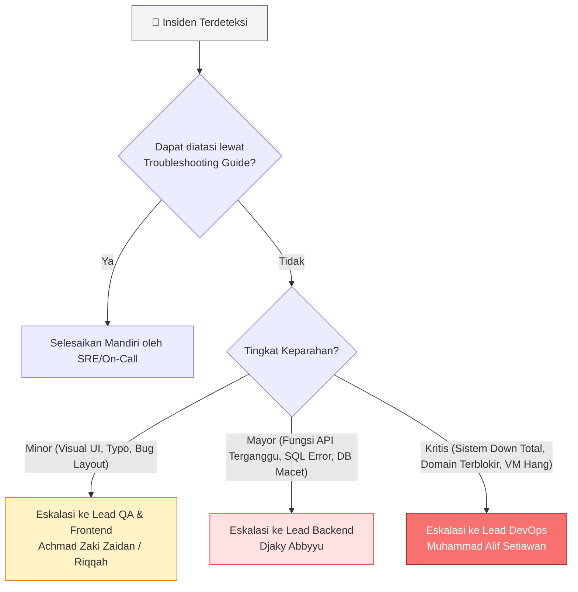

# 🛠️ Operations & Troubleshooting Guide — Sewain Platform (Kelompok Harahetta-2)

Dokumen ini berfungsi sebagai panduan operasional bagi tim SRE, DevOps, dan Pengembang untuk memantau kesehatan sistem, menganalisis log transaksi, melacak permintaan (request tracing), memantau metrik performa, serta menangani kendala teknis (troubleshooting) pada Arsitektur Monolith platform Sewain baik di lingkungan lokal maupun produksi (DeployCC).

## 📑 Daftar Isi

1. Arsitektur Operasional & Dependensi
2. Health Check & Liveness Monitoring
3. Manajemen & Analisis Log
4. Pelacakan Permintaan (Correlation ID)
5. Monitoring Metrik & Resource Container
6. Penanganan Masalah Umum (Common Troubleshooting)
7. Alur Eskalasi Insiden (Escalation Path)

---

# 1. Arsitektur Operasional & Dependensi

Sistem produksi Sewain berjalan menggunakan arsitektur monolitik terpusat dengan tiga container utama yang saling bergantung:

```text
Client Browser ──[HTTP / WebSockets]──> frontend Container (Port 3000 / 80)
                                                 │
                                                 ▼
                                        backend Container (FastAPI - Port 8000)
                                                 │
                                                 ▼
                                        monolith-db Container (PostgreSQL - Port 15432)
```

### Pemetaan Port & Relasi Container

- **frontend (Port Host 3000 -> Container 80):** Menyajikan antarmuka pengguna berbasis React 19.
- **backend (Port Host 8000 -> Container 8000):** Menjalankan mesin utama FastAPI untuk melayani REST API, koneksi WebSockets chat, dan integrasi Chatbot Gemini AI.
- **monolith-db (Port Host 15432 -> Container 5432):** Database PostgreSQL 16 terpusat yang menyimpan 14 tabel relasional data aplikasi.

---

# 2. Health Check & Liveness Monitoring

## 2.1 Memeriksa Kesehatan Backend Monolith

Untuk memverifikasi apakah server FastAPI berjalan dengan baik dan dapat terhubung ke database PostgreSQL, lakukan request ke endpoint `/health` menggunakan curl:

```bash
curl -i http://localhost:8000/health
```

### Ekspektasi Response (HTTP 200 OK)

```json
{
  "status": "healthy",
  "timestamp": "2026-06-13T10:30:00Z",
  "database": "connected"
}
```

## 2.2 Memeriksa Status Container via Docker Compose

Untuk memverifikasi bahwa ketiga container utama Sewain menyala dan berada dalam kondisi sehat (healthy):

```bash
docker compose ps
```

### Ekspektasi Output

```text
NAME                IMAGE               COMMAND                  SERVICE             CREATED             STATUS                    PORTS
backend             sewain-backend      "uvicorn main:app..."    backend             10 minutes ago      Up 10 minutes (healthy)   0.0.0.0:8000->8000/tcp
frontend            sewain-frontend     "/docker-entrypoint.…"   frontend            10 minutes ago      Up 10 minutes             0.0.0.0:3000->80/tcp
monolith-db         postgres:16-alpine  "docker-entrypoint.s…"   monolith-db         10 minutes ago      Up 10 minutes (healthy)   0.0.0.0:15432->5432/tcp
```

---

# 3. Manajemen & Analisis Log

## 3.1 Membaca Log Real-Time (Streaming)

Jika terjadi kendala pada server, gunakan perintah Docker Compose berikut untuk membaca baris log dari container:

```bash
# Log Real-time dari backend FastAPI saja
docker compose logs -f backend

# Log Real-time dengan timestamp pembacaan
docker compose logs -f --timestamps backend

# Log Real-time dari database PostgreSQL
docker compose logs -f monolith-db

# Log dengan filter membatasi hanya menampilkan 100 baris terakhir dari backend
docker compose logs --tail=100 backend
```

## 3.2 Format Structured Logging (JSON)

Backend FastAPI dikonfigurasi untuk menghasilkan log terstruktur dalam format JSON. Hal ini memudahkan proses pencarian dan integrasi dengan log aggregator:

```json
{
  "timestamp": "2026-06-13T10:35:12.456Z",
  "level": "INFO",
  "logger": "sewain.backend",
  "message": "Transaksi rental berhasil dibuat oleh user",
  "correlation_id": "req-9a8b7c6d-5e4f-3a2b-1c0d-9e8f7a6b5c4d",
  "user_id": 102,
  "method": "POST",
  "path": "/rentals",
  "status_code": 201,
  "response_time_ms": 280,
  "service": "backend"
}
```

---

# 4. Request Tracing dengan Correlation ID

## 4.1 Konsep Correlation ID pada Monolith

Meskipun berjalan dalam arsitektur Monolith, Sewain tetap mengimplementasikan Correlation ID untuk memudahkan pelacakan alur data dari client ke backend, hingga ke query database yang dieksekusi.

```text
[Browser Client] 
       │ Kirim Request + Header X-Correlation-ID (atau di-generate otomatis oleh Backend Middleware)
       ▼
[Backend FastAPI] 
       │ 1. Tangkap Correlation ID lewat Middleware
       │ 2. Rekam ID di setiap log transaksi (JSON Log)
       │ 3. Inject kembali ID ke dalam header HTTP Response
       ▼
[PostgreSQL DB]
```

## 4.2 Cara Tracing Kasus Error

Ketika pengguna melaporkan error transaksional (seperti: "Gagal melakukan checkout pembayaran"), tim operasional dapat mengidentifikasi masalah secara cepat dengan langkah-langkah berikut:

1. Ambil nilai `X-Correlation-ID` dari konsol jaringan browser pengguna atau header response HTTP (misal: `req-9a8b7c6d-5e4f-3a2b-1c0d-9e8f7a6b5c4d`).
2. Jalankan pencarian log pada container backend menggunakan perintah grep:

```bash
docker compose logs backend | grep "req-9a8b7c6d-5e4f-3a2b-1c0d-9e8f7a6b5c4d"
```

### Contoh Hasil Filter Log

```text
backend_1  | {"timestamp": "10:35:10", "level": "INFO", "message": "Received POST /rentals", "correlation_id": "req-9a8b7c6d-5e4f-3a2b-1c0d-9e8f7a6b5c4d"}
backend_1  | {"timestamp": "10:35:11", "level": "INFO", "message": "Token JWT valid untuk user_id 102", "correlation_id": "req-9a8b7c6d-5e4f-3a2b-1c0d-9e8f7a6b5c4d"}
backend_1  | {"timestamp": "10:35:12", "level": "ERROR", "message": "Midtrans Snap API Error: Authentication Failed (Server Key salah/invalid)", "correlation_id": "req-9a8b7c6d-5e4f-3a2b-1c0d-9e8f7a6b5c4d"}
```

Kesimpulan Analisis: Transaksi gagal karena kesalahan otentikasi kunci server (Server Key) pada integrasi SDK pembayaran Midtrans di sisi backend.

---

# 5. Monitoring Metrik & Resource Container

## 5.1 Endpoint Metrik Aplikasi

Metrik internal aplikasi backend dapat dipantau secara langsung melalui endpoint metrik yang telah disediakan:

```bash
curl http://localhost:8000/metrics
```

## 5.2 Memantau Penggunaan Resource Fisik Container

Untuk mengawasi performa pemakaian CPU dan Memory RAM pada server VM DeployCC, jalankan utilitas pemantauan real-time bawaan Docker:

```bash
docker stats
```

### Panduan Batas Aman Penggunaan Resource

| Metrik | Kondisi Normal | Butuh Investigasi | Tindakan Korektif |
|---------|---------|---------|---------|
| CPU Usage | < 80% | > 80% (Berkelanjutan) | Periksa apakah ada proses loop tak terbatas (infinite loop) atau optimalkan penulisan query SQL. |
| Memory Usage | < 85% | > 85% | Ada indikasi kebocoran memori (memory leak). Siapkan restart terjadwal pada container backend. |
| Memory Limit | Aman | > 95% | Risiko tinggi terkena Out of Memory (OOM) Killer. Segera naikkan limit RAM di VM/VPS server produksi. |

---

# 6. Penanganan Masalah Umum (Common Troubleshooting)

## Masalah 1: Database Connection Refused (PostgreSQL)

**Gejala:** Log backend memuntahkan pesan error: *Is the server running on host "monolith-db" and accepting TCP/IP connections on port 5432?*.

### Solusi Pemulihan

```bash
# 1. Pastikan container database menyala
docker compose ps monolith-db

# 2. Jika status Down, nyalakan kembali container DB
docker compose up -d monolith-db

# 3. Lakukan restart pada backend untuk membangun ulang koneksi pool
docker compose restart backend
```

## Masalah 2: Token JWT Kadaluarsa / Gagal Autentikasi

**Gejala:** Endpoint mengembalikan status HTTP 401 Unauthorized dengan detail "Token tidak valid atau sudah expired".

### Langkah Diagnosis & Solusi

- Periksa sinkronisasi waktu UTC pada VM server DeployCC (`date -u`). Jika waktu server tidak sinkron dengan waktu global, validasi waktu kadaluarsa token JWT akan meleset.
- Pastikan parameter `SECRET_KEY` di file `.env` pada server produksi sama persis dengan yang diset pada saat pengembangan awal. Jika parameter ini diubah tanpa sengaja, seluruh token pengguna akan menjadi tidak valid.

## Masalah 3: Masalah CORS Blocked pada Browser Client

**Gejala:** Konsol browser menunjukkan error: *Access to fetch at '...' has been blocked by CORS policy.*

### Langkah Diagnosis & Perbaikan

- Periksa konfigurasi middleware CORS di file `backend/main.py`. Pastikan origin dari domain frontend yang sedang berjalan di produksi telah didaftarkan dalam daftar `allow_origins`.
- Periksa apakah variabel lingkungan `.env` pada frontend (`VITE_API_URL`) sudah menunjuk ke alamat IP/Domain backend produksi yang benar, bukan mengarah ke localhost lokal.

---

# 7. Alur Eskalasi Insiden (Escalation Path)

Jika insiden operasional atau degradasi performa sistem tidak dapat diselesaikan melalui panduan troubleshooting di atas, segera lakukan eskalasi kepada anggota kelompok penanggung jawab.

## Bagan Alur Eskalasi



## Detail Kontak Penanggung Jawab Kelompok Harahetta-2

### Tingkat Masalah Minor (Frontend, UI/UX, & QA)

- Achmad Zaki Zaidan (Lead Frontend - 10231002)
- Riqqah Khalda Karina (Lead QA & Docs - 10231082)

### Tingkat Masalah Mayor (Core API & Database Integrasi)

- Djaky Abbyyu Fauzan Timumum (Lead Backend - 10231032)

### Tingkat Masalah Kritis (Infrastruktur VPS DeployCC, Container, & CI/CD Pipeline)

- Muhammad Alif Setiawan (Lead DevOps - 10231056)
