# AUTHENTICATION AND CRUD TESTING

Bagian ini menjelaskan hasil pengujian pada fitur keamanan dan manajemen akun pengguna.

1. **Register User**

    Langkah uji: Mengisi seluruh form pendaftaran (Username, Email, Password) dan menekan tombol **"Register"**
    
    Hasil yang diharapkan: Akun berhasil dibuat dan sistem otomatis mengarahkan pengguna ke dashboard
    
    Hasil sebenarnya: User berhasil dibuat dan masuk ke dashboard
    
    Status: 🟢 PASS
    
    **Bukti Screenshot Pengujian**  
    

2. **Validasi Register**

    Langkah uji: Mengosongkan salah satu atau seluruh field pada form register lalu menekan tombol **"Register"**

    Hasil yang diharapkan: Sistem menampilkan pesan error dan mencegah pengiriman data ke server

    Hasil sebenarnya: Muncul pesan error dan data tidak dikirim

    Status: 🟢 PASS

    **Bukti Screenshot Pengujian**  
    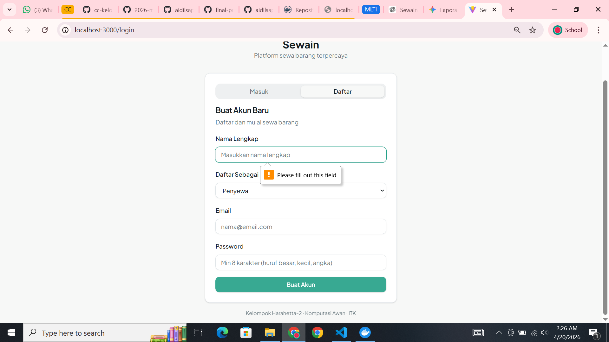

3. **Login Berhasil**

    Langkah uji: Memasukkan kredensial (Email & Password) yang valid pada halaman login

    Hasil yang diharapkan: Sistem mengenali pengguna dan memberikan akses ke halaman dashboard

    Hasil sebenarnya: User berhasil masuk ke dashboard

    Status: 🟢 PASS

    **Bukti Screenshot Pengujian**  
    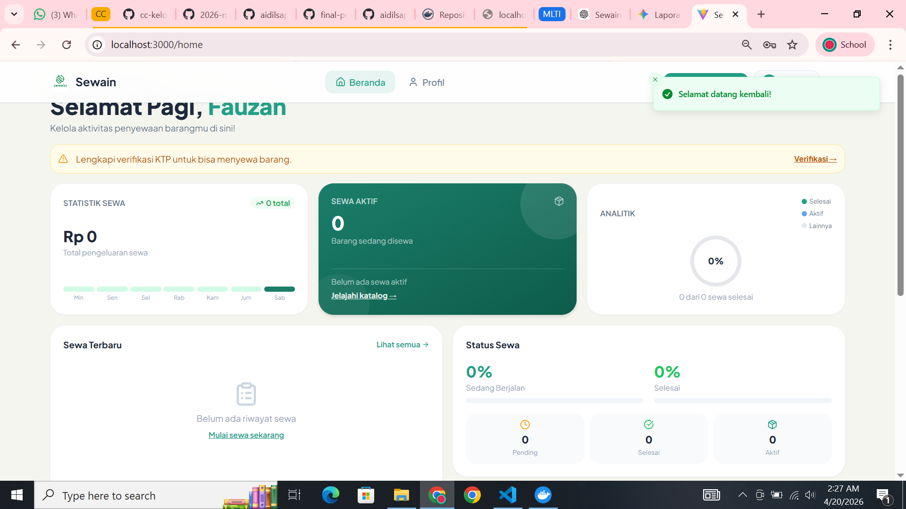

4. **Login Gagal**

    Langkah uji: Memasukkan email atau password yang tidak sesuai dengan database

    Hasil yang diharapkan: Sistem menolak akses dan menampilkan pesan error login gagal

    Hasil sebenarnya: Muncul error login gagal

    Status: 🟢 PASS

    **Bukti Screenshot Pengujian**  
    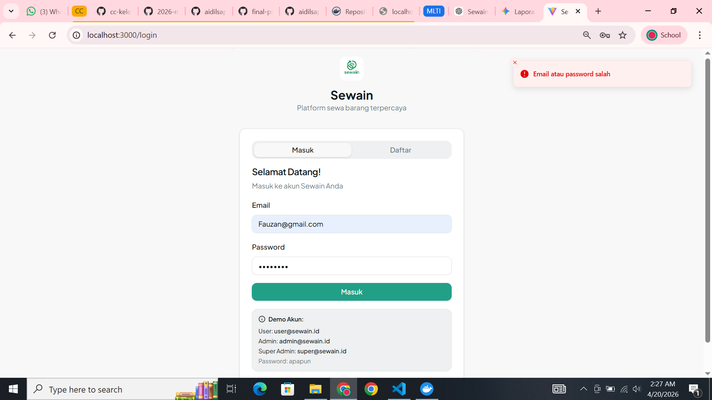

5. **Logout**

    Langkah uji: Menekan tombol **"Logout"** pada menu profil atau sidebar

    Hasil yang diharapkan: Sesi pengguna berakhir dan sistem mengarahkan kembali ke halaman login

    Hasil sebenarnya: Kembali ke halaman login

    Status: 🟢 PASS

    **Bukti Screenshot Pengujian**  
    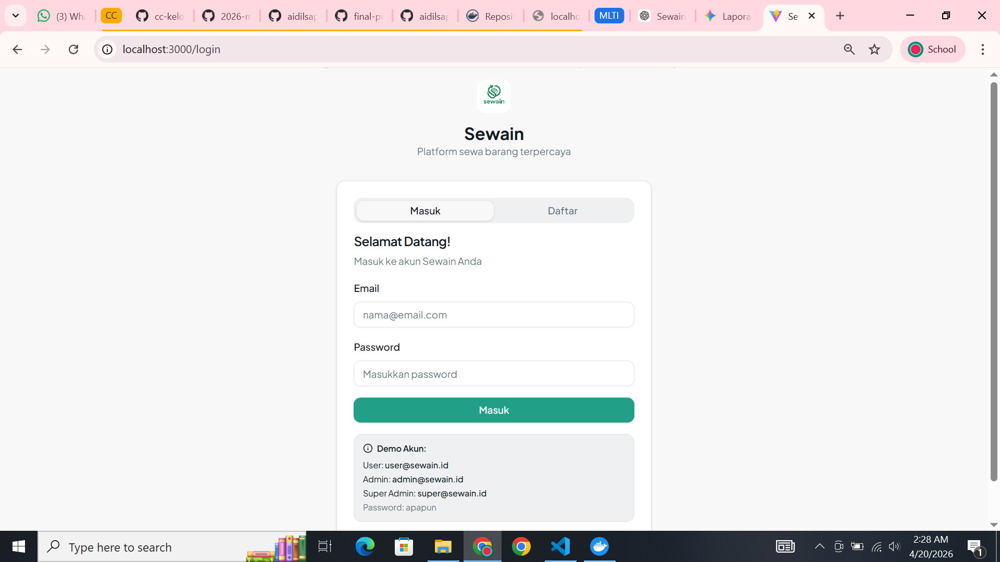

---

# CRUD TESTING

Bagian ini menjelaskan pengujian fungsionalitas pengolahan data item pada sistem.

1. **Create Item**

    Langkah uji: Mengisi data pada form tambah item dan menekan tombol **"Simpan"**

    Hasil yang diharapkan: Data baru tersimpan dan langsung muncul pada tabel/daftar dashboard

    Hasil sebenarnya: Item baru muncul di dashboard

    Status: 🟢 PASS

    **Bukti Screenshot Pengujian**  
    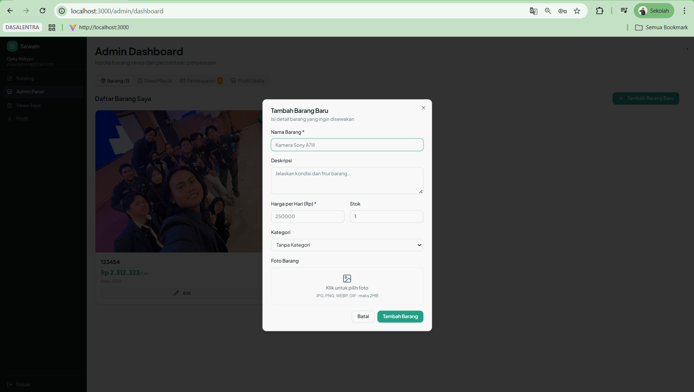

2. **Validasi Form**

    Langkah uji: Mencoba menambah item tanpa mengisi field wajib (required)

    Hasil yang diharapkan: Muncul peringatan validasi pada field yang kosong

    Hasil sebenarnya: Muncul error dan data tidak dikirim

    Status: 🟢 PASS

    **Bukti Screenshot Pengujian**  
    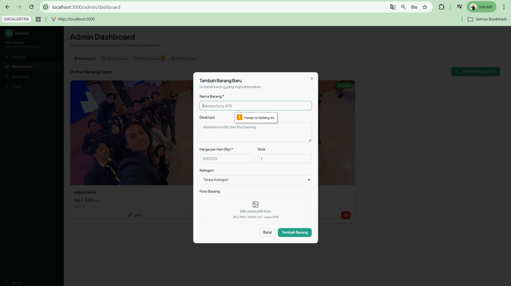

3. **Read Data**

    Langkah uji: Membuka dashboard utama setelah data tersedia

    Hasil yang diharapkan: Menampilkan daftar seluruh item yang ditarik dari API/Database secara akurat

    Hasil sebenarnya: Semua item tampil dengan data lengkap

    Status: 🟢 PASS

    **Bukti Screenshot Pengujian**  
    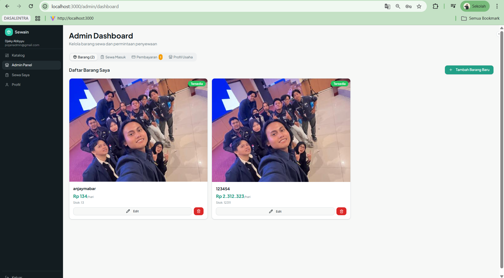

4. **Update Item**

    Langkah uji: Memilih satu item, mengubah informasinya, dan menyimpan perubahan

    Hasil yang diharapkan: Perubahan data terupdate di tampilan dan tersimpan permanen di database

    Hasil sebenarnya: Data berubah di UI dan database

    Status: 🟢 PASS

    **Bukti Screenshot Pengujian**  
    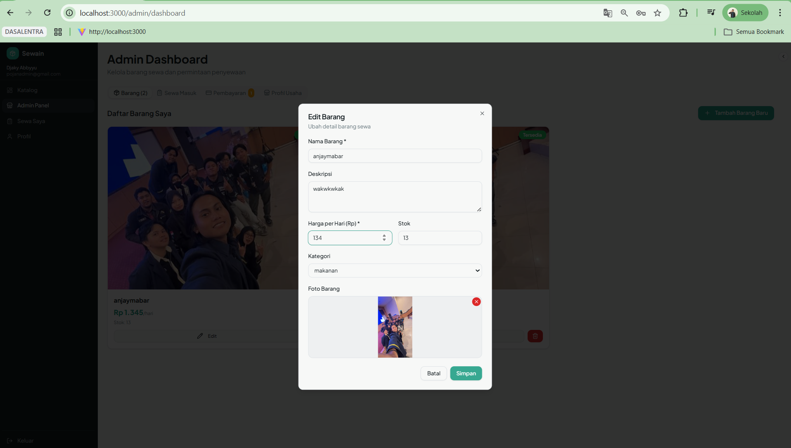

5. **Delete Item**
    
    Langkah uji: Menekan tombol hapus pada salah satu item dan mengonfirmasi tindakan tersebut

    Hasil yang diharapkan: Data terhapus dari daftar dan tidak lagi tersedia di database

    Hasil sebenarnya: Item terhapus dari UI dan database

    Status: 🟢 PASS

    **Bukti Screenshot Pengujian**  
    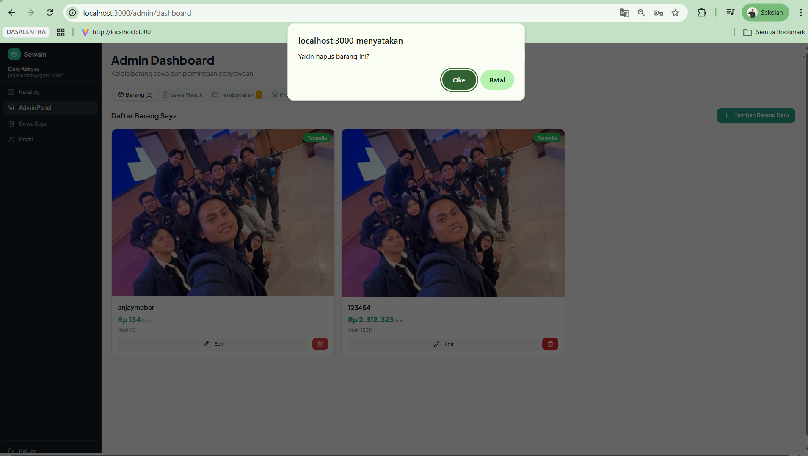

---

# END-TO-END (E2E) TESTING

Pengujian alur pengguna secara menyeluruh dari awal hingga akhir aplikasi.

1. **Buka Aplikasi**

    Langkah uji: Mengakses URL localhost:3000 pada browser

    Status: 🟢 PASS

    **Bukti Screenshot Pengujian**  
    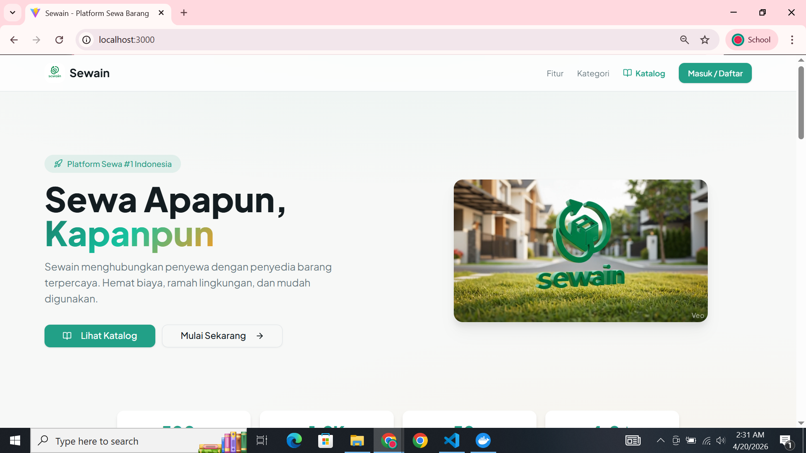

2. **Register User**

    Langkah uji: Melakukan pendaftaran akun baru melalui halaman registrasi

    Status: 🟢 PASS

    **Bukti Screenshot Pengujian**  
    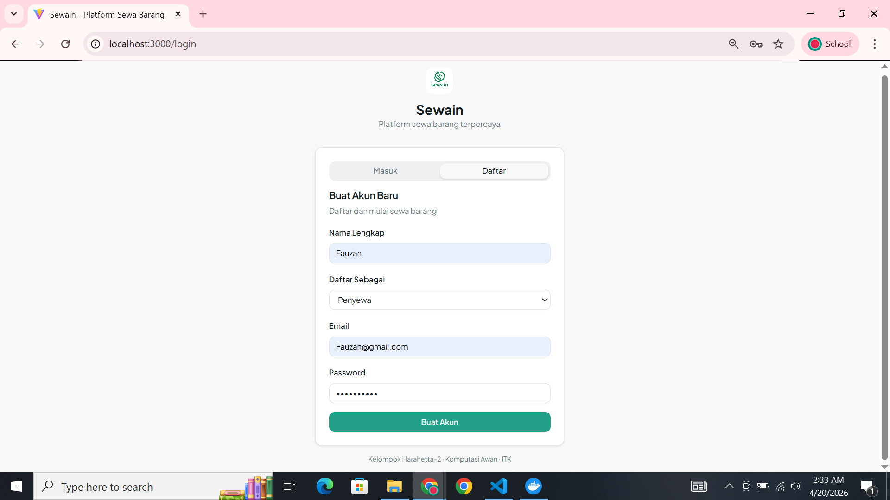

3. **Auto Login**

    Langkah uji: Memastikan sistem mengarahkan ke dashboard secara otomatis setelah registrasi berhasil

    Status: 🟢 PASS

    **Bukti Screenshot Pengujian**  
    

4. **Dashboard Tampil**
    
    Langkah uji: Memastikan seluruh elemen dashboard dan data item termuat sempurna setelah login

    Status: 🟢 PASS

    **Bukti Screenshot Pengujian**  
    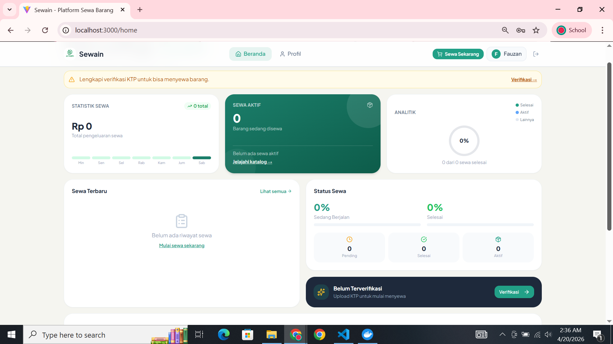

5. **Nama User Muncul**

    Langkah uji: Memvalidasi apakah nama user yang terdaftar muncul di bagian header/navbar

    Status: 🟢 PASS

    **Bukti Screenshot Pengujian**  
    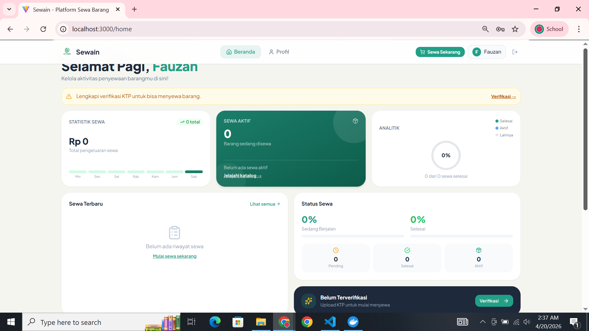

6. **CRUD Berjalan**

    Langkah uji: Melakukan satu siklus penuh (Tambah, Edit, Hapus) pada modul item

    Status: 🟢 PASS

    **Bukti Screenshot Pengujian**  
    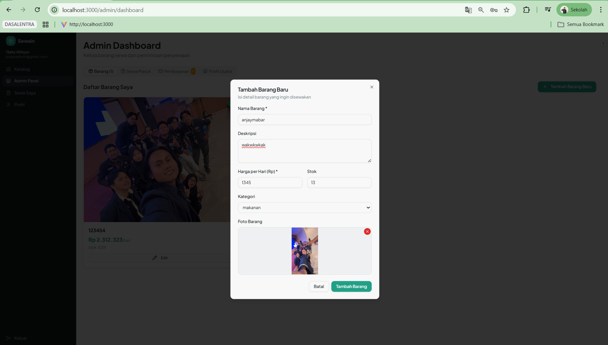

7. **Logout**

    Langkah uji: Mengakhiri sesi pengguna dengan menekan tombol logout

    Status: 🟢 PASS

    **Bukti Screenshot Pengujian**  
    

8. **Login Ulang**

    Langkah uji: Mencoba masuk kembali menggunakan akun yang baru saja dibuat

    Status: 🟢 PASS

    **Bukti Screenshot Pengujian**  
    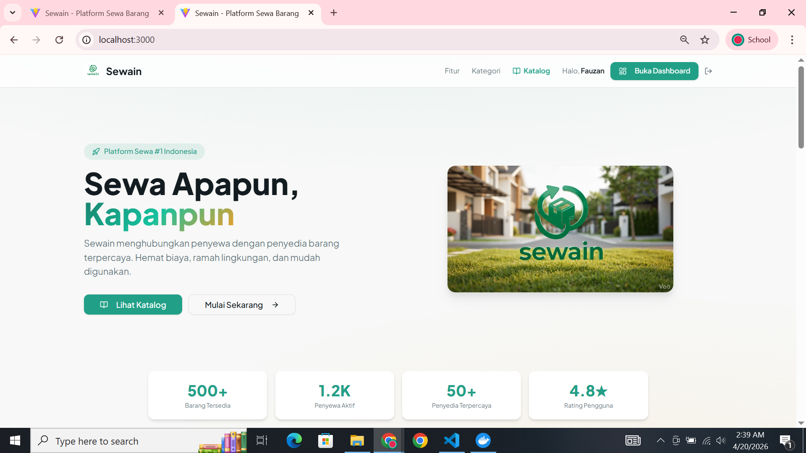

9. **Data Tetap Ada**

    Langkah uji: Memastikan data yang telah diinput sebelumnya masih tersimpan (persisten) setelah login ulang
    
    Status: 🟢 PASS

    **Bukti Screenshot Pengujian**  
    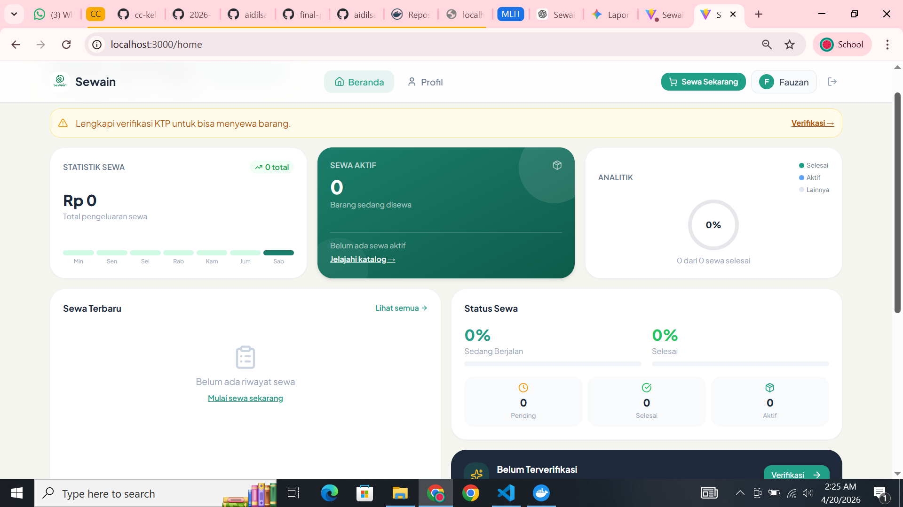