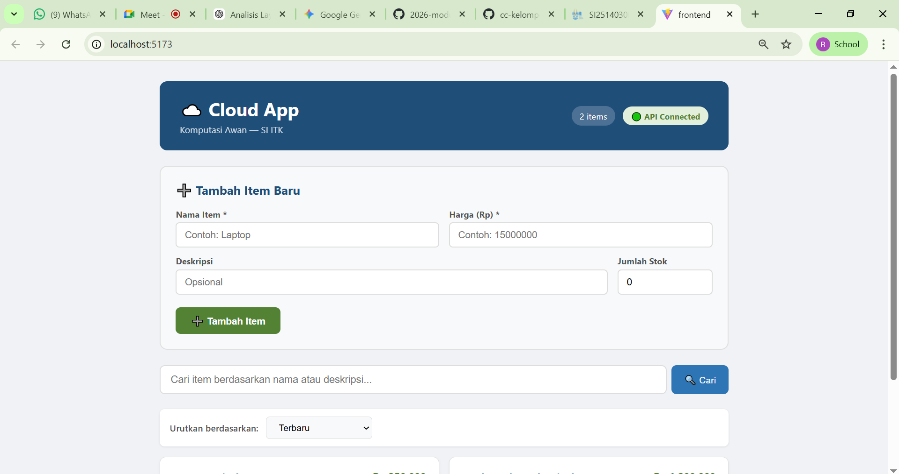
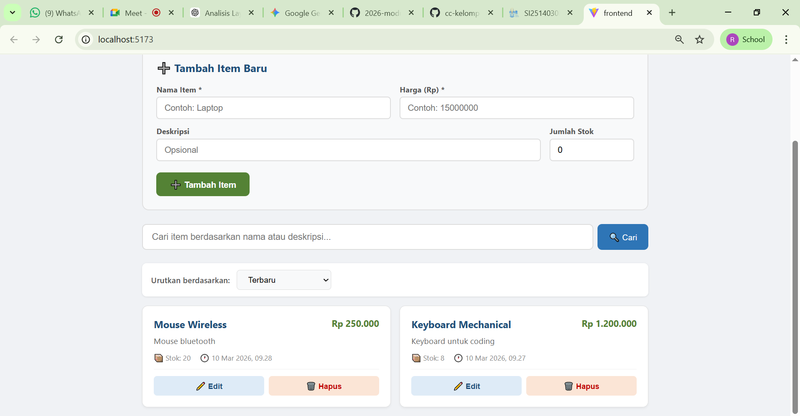
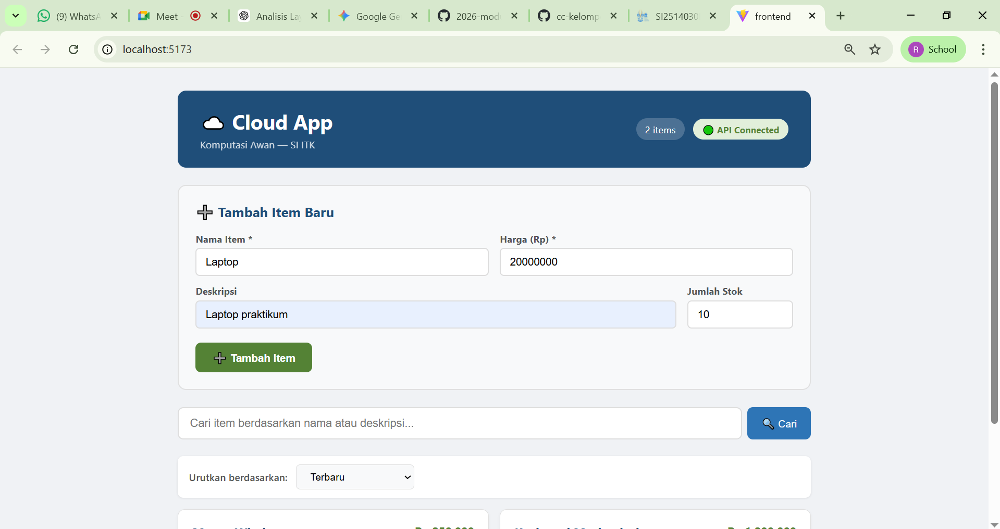
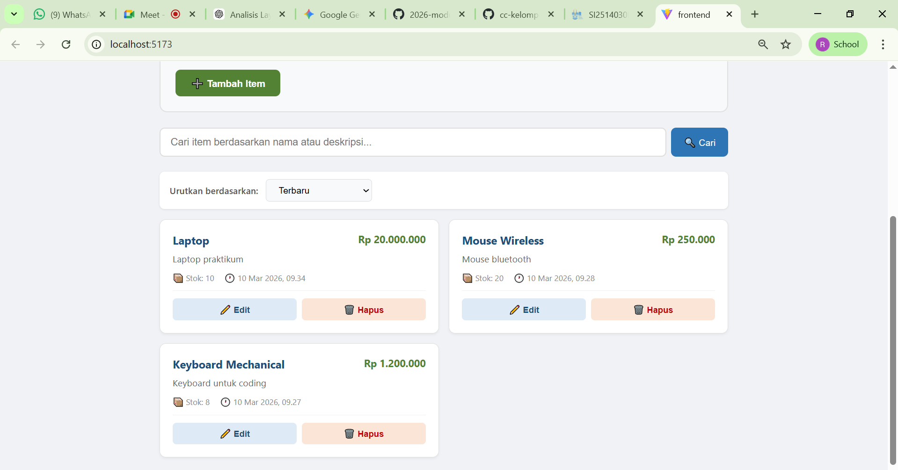
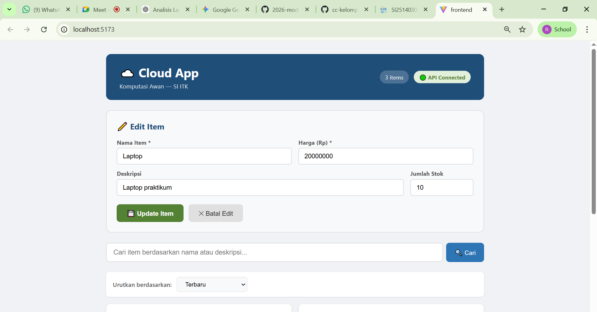
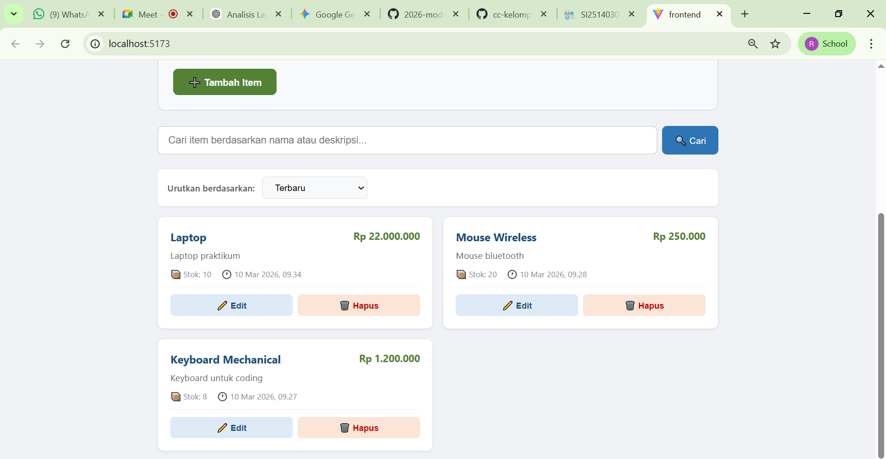
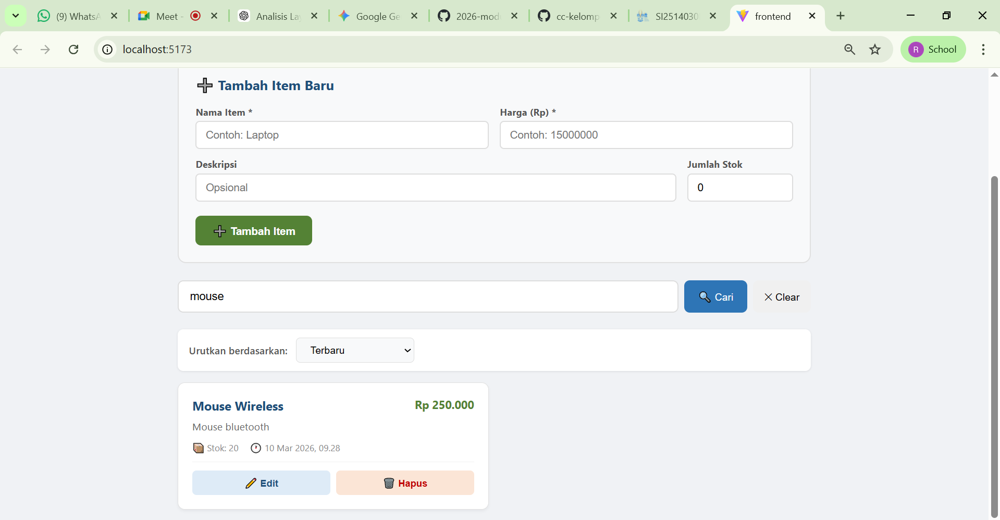
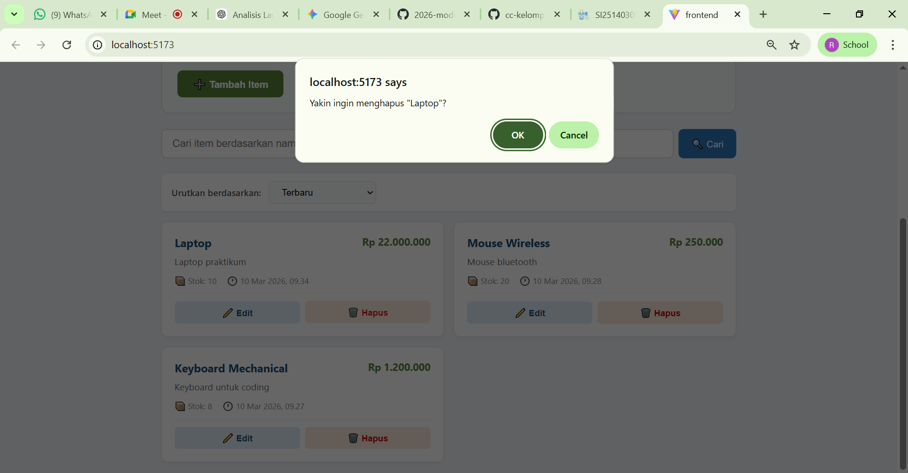
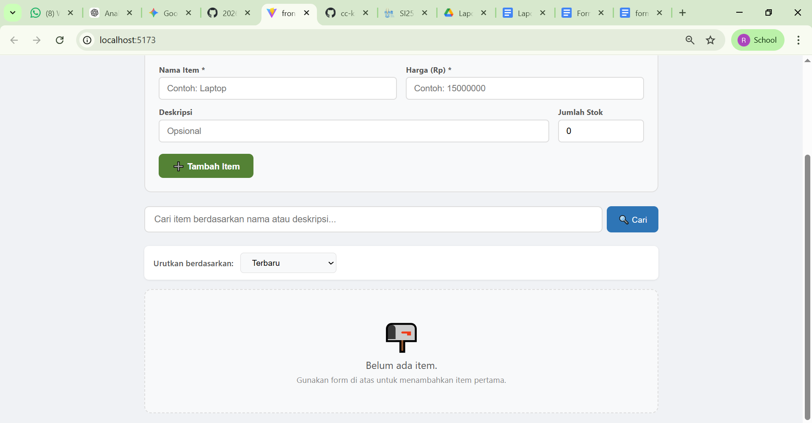

# Checklist Testing Modul 3

Berikut adalah hasil pengujian integrasi antara Frontend (React) dan Backend (FastAPI) berdasarkan 10 skenario pengujian utama:

1. **Status API**  
   Langkah uji: Cek koneksi di dashboard  
   Status: 🟢 PASS
   
   **Bukti Screenshot Pengujian** 
   

2. **Sync Data**  
   Langkah uji: Cek daftar item dari DB  
   Status: 🟢 PASS
   
   **Bukti Screenshot Pengujian** 
   

3. **Create**  
   Langkah uji: Tambah item via form  
   Status: 🟢 PASS

   **Bukti Screenshot Pengujian** 
   

4. **Read**  
   Langkah uji: Pastikan item baru muncul  
   Status: 🟢 PASS

   **Bukti Screenshot Pengujian** 
   

5. **Edit Mode**  
   Langkah uji: Klik tombol edit  
   Status: 🟢 PASS

   **Bukti Screenshot Pengujian** 
   

6. **Update**  
   Langkah uji: Ubah harga & simpan  
   Status: 🟢 PASS

   **Bukti Screenshot Pengujian** 
   

7. **Search**  
   Langkah uji: Cari via Search Bar  
   Status: 🟢 PASS

   **Bukti Screenshot Pengujian** 
   

8. **Delete Dialog**  
   Langkah uji: Klik hapus (muncul dialog)  
   Status: 🟢 PASS

   **Bukti Screenshot Pengujian** 
   

9. **Delete Action**  
   Langkah uji: Konfirmasi hapus (data terhapus dari daftar)  
   Status: 🟢 PASS

   **Bukti Screenshot Pengujian** 
   

10. **Empty State**  
    Langkah uji: Hapus semua data  
    Status: 🟢 PASS

    **Bukti Screenshot Pengujian** 
   